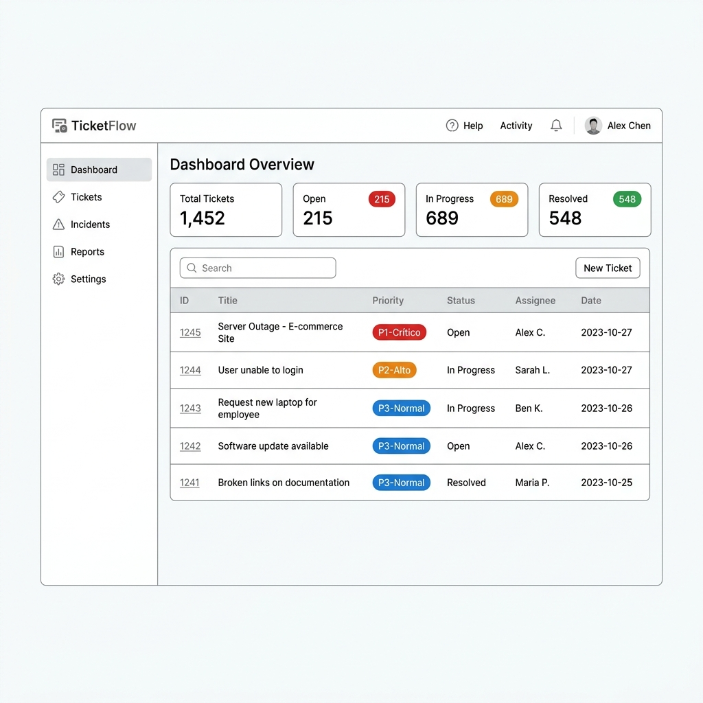
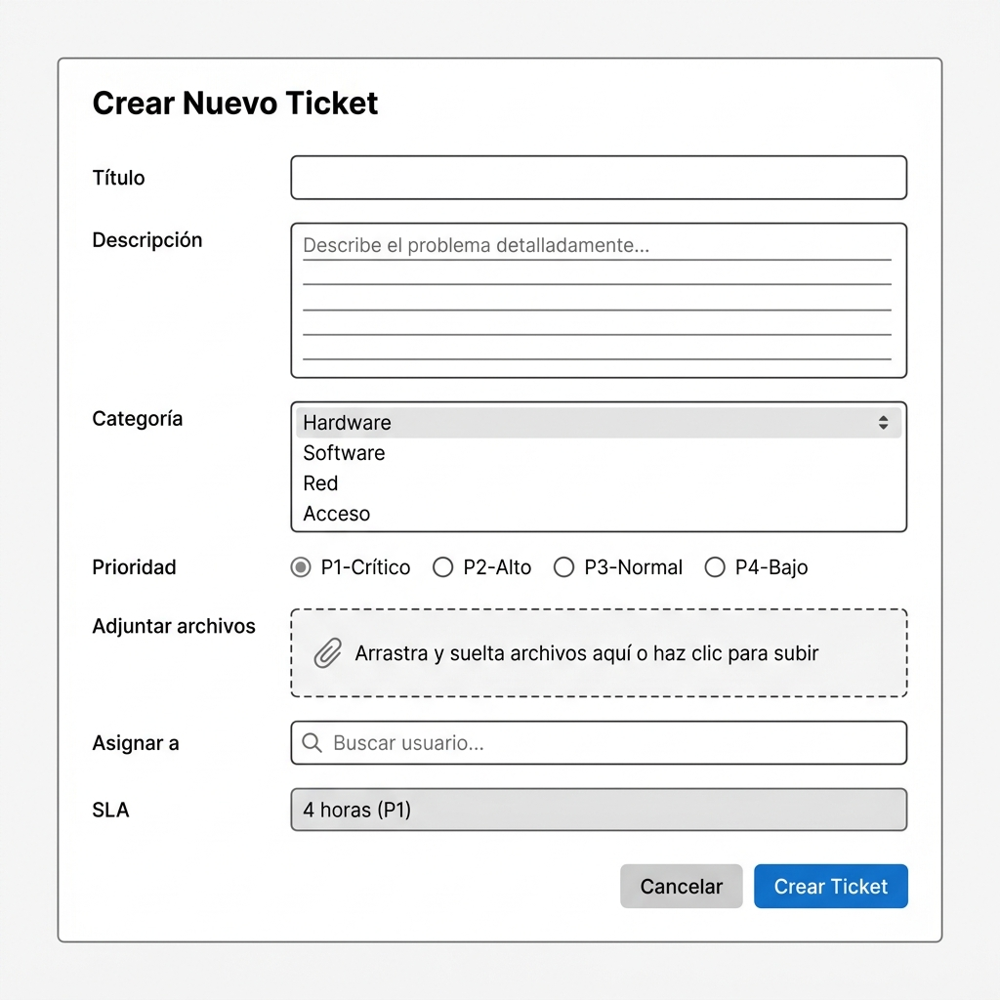
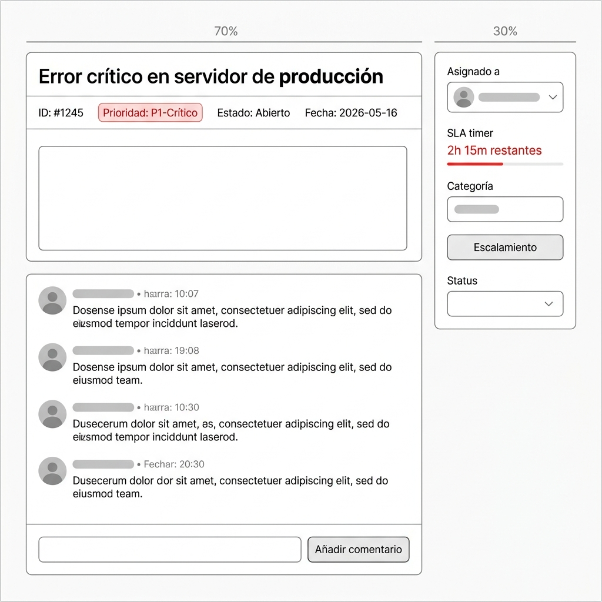
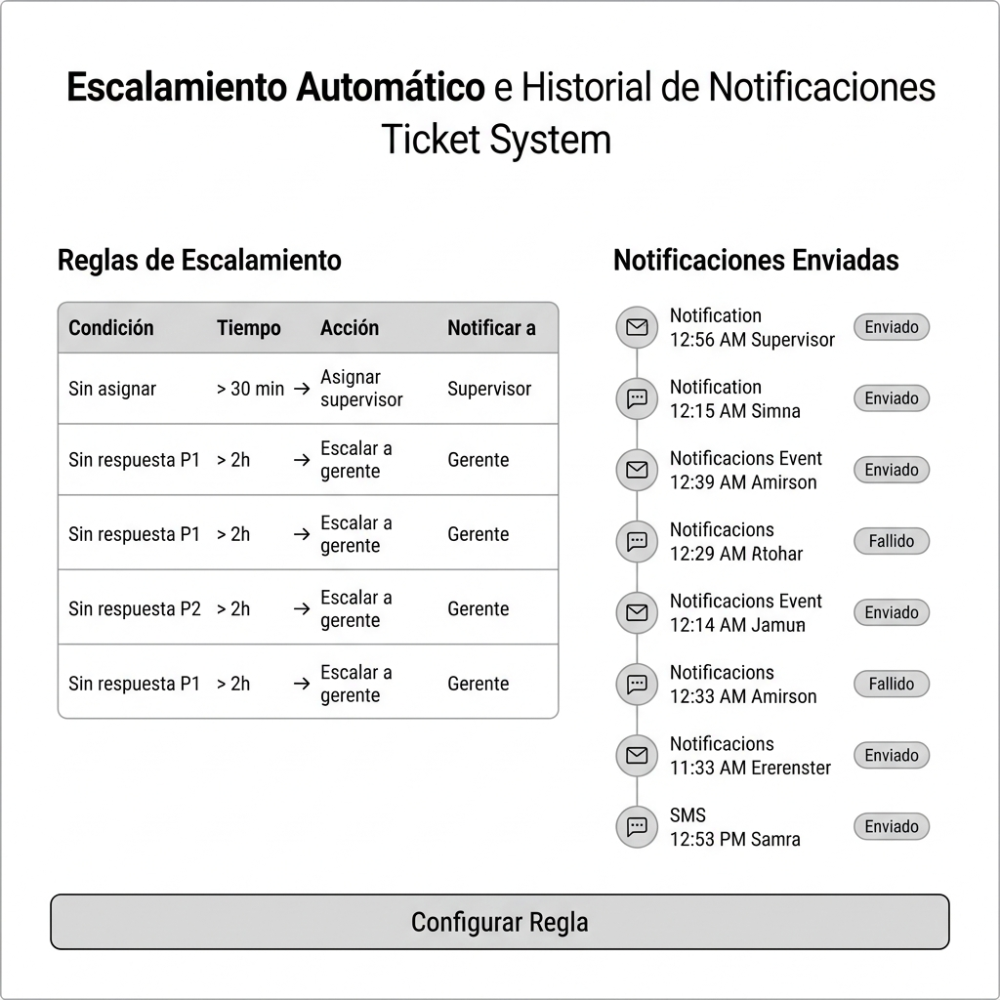
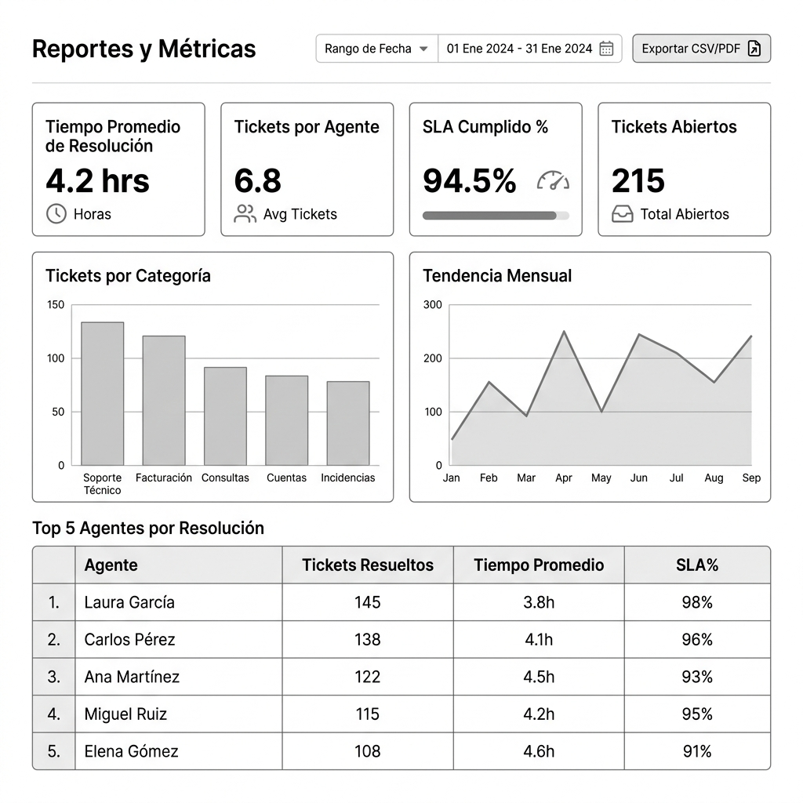
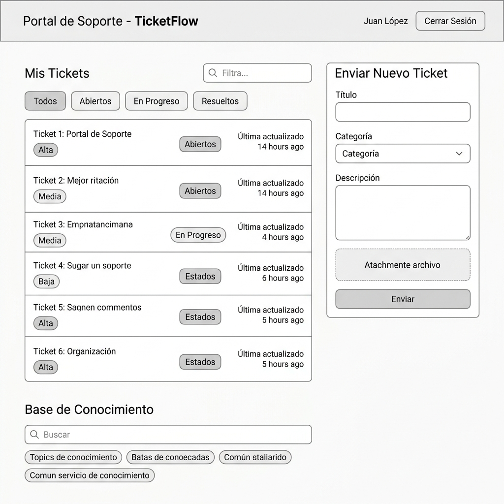

# TicketFlow — Sistema de Tickets e Incidentes
## Entrega 1: Pitch, Scope y Mockups

---

**Universidad Galileo**  
Postgrado en Diseño y Desarrollo de Software  
Infraestructura en la Nube · Ciclo Mayo–Junio 2026

**Equipo 6**  
- Francisco Magdiel Asicona Mateo — 26006399  
- Sergio Geovany García Smith — 25008130  
- Sergio Rolando Oliva del Valle — 26005694

**Fecha de entrega:** domingo 10 de mayo de 2026  
**Versión del documento:** 1.0

---

## Tabla de Contenidos

1. [Resumen Ejecutivo](#1-resumen-ejecutivo)
2. [Actores del Sistema](#2-actores-del-sistema)
3. [Casos de Uso Priorizados](#3-casos-de-uso-priorizados)
4. [Funcionalidades Específicas del Proyecto](#4-funcionalidades-específicas-del-proyecto)
5. [Mockups del Frontend](#5-mockups-del-frontend)
6. [Mapeo a Conceptos del Curso](#6-mapeo-a-conceptos-del-curso)
7. [Scope (In/Out)](#7-scope-inout)
8. [Preguntas Abiertas](#8-preguntas-abiertas)
9. [Anexo IA](#9-anexo-ia)

---

## 1. Resumen Ejecutivo

En la actualidad compañias de diversos sectores enfrentan un problema recurrente: los incidentes operativos y solicitudes de soporte se gestionan a través de canales dispersos (correo, Slack, llamadas) sin trazabilidad, sin SLAs definidos y sin visibilidad para la gerencia. El resultado es que los problemas críticos se pierden entre ruido, los tiempos de respuesta son inconsistentes y es imposible medir la calidad del soporte.

**TicketFlow** es un sistema backend de gestión de tickets e incidentes diseñado para equipos que busquen una trazabilidad y ejecucion optima de sus operaciones de entre 10 y 200 personas. Centraliza el registro, priorización, asignación y seguimiento de solicitudes operativas en un único sistema con SLAs configurables por prioridad, escalamiento automático cuando los tiempos se incumplen, y notificaciones multicanal (email, SMS) para mantener a los involucrados informados sin que tengan que consultar el sistema.

**Qué evita o automatiza:**
- Elimina el seguimiento manual por correo y Slack.
- Evita que las peticiones queden rezagadas o perdidas en el día a día sin que se les proporcione su debido seguimiento.
- Automatiza el escalamiento: si un ticket P1 no tiene respuesta en 2 horas, el sistema escala automáticamente al supervisor sin intervención humana.
- Genera reportes de resolución y cumplimiento de SLA sin trabajo manual del equipo.

---

## 2. Actores del Sistema

### Actores Primarios
*(Inician interacciones o son el beneficiario directo de las funcionalidades)*

| Actor | Descripción | Interacción principal |
|---|---|---|
| **Usuario final (Solicitante)** | Empleado o cliente que reporta un problema o solicita soporte | Crea tickets, adjunta evidencias, consulta el estado de su solicitud |
| **Agente de soporte** | Técnico responsable de resolver tickets asignados | Recibe asignaciones, define líneas de escalamiento, actualiza estados, agrega comentarios, cierra tickets |
| **Supervisor / Líder de equipo** | Coordina al equipo de agentes, gestiona escalamientos | Reasigna tickets, revisa métricas de su equipo, configura reglas de escalamiento |

### Actores de Soporte
*(Sistemas externos o actores secundarios que complementan el flujo)*

| Actor | Descripción | Interacción |
|---|---|---|
| **Servicio de correo electrónico** | Proveedor SMTP (ej. Amazon SES) | Envía notificaciones a usuarios, agentes y supervisores |
| **Servicio de SMS** | Proveedor de mensajería (ej. Amazon SNS) | Envía alertas críticas P1/P2 fuera de horario |
| **Administrador del sistema** | Configura categorías, SLAs, usuarios y permisos | Accede al panel de administración, gestiona la configuración global |

---

## 3. Casos de Uso Priorizados

### Priorización: P0 = Crítico para el MVP | P1 = Importante | P2 = Deseable

---

**UC-01 · P0 — Crear y enviar un ticket de soporte**

| Campo | Detalle |
|---|---|
| **ID** | UC-01 |
| **Prioridad** | P0 — Crítico para el MVP |
| **Actor** | Usuario final (Solicitante) |
| **Como** | Usuario final |
| **Quiero** | Registrar un nuevo ticket con título, descripción, categoría y adjuntos |
| **Para que** | El equipo de soporte pueda atender mi problema de manera inmediata, formal y trazable |
| **Criterio de éxito** | El ticket queda registrado con un ID único, se asigna la prioridad correspondiente, el usuario recibe confirmación por correo con el ID del ticket, y el ticket aparece en la cola del agente en menos de 30 segundos |

---

**UC-02 · P0 — Asignar y gestionar tickets**

| Campo | Detalle |
|---|---|
| **ID** | UC-02 |
| **Prioridad** | P0 — Crítico para el MVP |
| **Actor** | Agente de soporte |
| **Como** | Agente de soporte |
| **Quiero** | Recibir tickets en mi cola, actualizar su estado (En progreso → Resuelto) y agregar comentarios internos |
| **Para que** | El solicitante y el supervisor puedan ver el avance en tiempo real |
| **Criterio de éxito** | El agente puede cambiar el estado del ticket, agregar comentarios visibles al solicitante o solo internos, y el sistema registra la marca de tiempo de cada acción. El solicitante recibe una notificación automática al cambiar el estado |

---

**UC-03 · P0 — Escalamiento automático por SLA vencido**

| Campo | Detalle |
|---|---|
| **ID** | UC-03 |
| **Prioridad** | P0 — Crítico para el MVP |
| **Actor** | Supervisor / Líder de equipo |
| **Como** | Supervisor |
| **Quiero** | Que el sistema me notifique automáticamente cuando un ticket supera el tiempo de SLA sin respuesta |
| **Para que** | Ningún incidente crítico quede sin atención por olvido o sobrecarga |
| **Criterio de éxito** | El sistema evalúa tickets cada 5 minutos. Si un ticket P0 supera 2 horas sin actualización, se envía notificación al supervisor y se reasigna. El ticket queda marcado como "escalado" con registro del evento |

---

**UC-04 · P1 — Priorización automática por categoría e impacto**

| Campo | Detalle |
|---|---|
| **ID** | UC-04 |
| **Prioridad** | P1 — Importante |
| **Actor** | Agente de soporte |
| **Como** | Agente de soporte |
| **Quiero** | Que el sistema sugiera una prioridad inicial (P0–P4) basada en la categoría y palabras clave del título |
| **Para que** | Los tickets críticos no queden enterrados entre solicitudes de baja urgencia |
| **Criterio de éxito** | Al crear el ticket, el sistema sugiere una prioridad con base en reglas configurables. El agente puede ajustarla manualmente y el SLA se recalcula automáticamente |

---

**UC-05 · P1 — Portal de autoservicio para usuarios finales**

| Campo | Detalle |
|---|---|
| **ID** | UC-05 |
| **Prioridad** | P1 — Importante |
| **Actor** | Usuario final (Solicitante) |
| **Como** | Usuario final |
| **Quiero** | Ver el estado de todos mis tickets abiertos, el historial de comunicaciones y el tiempo estimado de resolución |
| **Para que** | No necesite contactar al equipo de soporte para preguntar en qué estado está mi caso |
| **Criterio de éxito** | El usuario puede autenticarse en el portal, ver todos sus tickets con estado actualizado, leer el historial de comentarios y recibir notificaciones automáticas ante cualquier cambio |

---

**UC-06 · P1 — Reportes de desempeño y cumplimiento de SLA**

| Campo | Detalle |
|---|---|
| **ID** | UC-06 |
| **Prioridad** | P1 — Importante |
| **Actor** | Supervisor / Líder de equipo |
| **Como** | Supervisor |
| **Quiero** | Acceder a reportes con métricas de tiempo de resolución, tickets por agente y porcentaje de SLA cumplido |
| **Para que** | Pueda identificar cuellos de botella y mejorar la distribución de carga |
| **Criterio de éxito** | El reporte se genera bajo demanda o de forma programada. Incluye tiempo promedio de resolución, tasa de SLA, distribución por agente y tendencia histórica. Exportable a CSV/PDF |

---

**UC-07 · P2 — Búsqueda en base de conocimiento**

| Campo | Detalle |
|---|---|
| **ID** | UC-07 |
| **Prioridad** | P2 — Deseable |
| **Actor** | Usuario final (Solicitante) |
| **Como** | Usuario final |
| **Quiero** | Buscar artículos de solución antes de crear un ticket |
| **Para que** | Pueda resolver problemas comunes de forma autónoma sin esperar a un agente |
| **Criterio de éxito** | Al iniciar la creación de un ticket, el sistema sugiere artículos relacionados con el título ingresado. Si el usuario encuentra la solución, puede descartar la creación del ticket |

---

**UC-08 · P2 — Notificaciones multicanal configurables**

| Campo | Detalle |
|---|---|
| **ID** | UC-08 |
| **Prioridad** | P2 — Deseable |
| **Actor** | Agente de soporte / Supervisor |
| **Como** | Agente o supervisor |
| **Quiero** | Configurar qué eventos me notifican por correo y cuáles por SMS |
| **Para que** | Solo reciba alertas por el canal adecuado según la urgencia |
| **Criterio de éxito** | Cada usuario configura sus preferencias por tipo de evento (asignación, escalamiento, resolución). Las notificaciones P0-P1 siempre envían SMS independientemente de las preferencias |

---

## 4. Funcionalidades Específicas del Proyecto

Estas son las funcionalidades que diferencian a TicketFlow del enunciado genérico. Lo genérico (CRUD de tickets) no se lista aquí.

### 4.1 Motor de SLA con cálculo dinámico
- Tiempos de respuesta y resolución configurables por prioridad: P0 (2h respuesta / 4h resolución), P1 (4h/8h), P2 (8h/24h), P3 (24h/72h), P4 (72h/120h).
- El reloj de SLA se pausa fuera del horario laboral configurable (ej. 8:00–18:00 en zona horaria del cliente).
- Los tickets con SLA en riesgo (>75% del tiempo consumido) se marcan visualmente en la interfaz del agente.

### 4.2 Reglas de escalamiento configurables
- Los supervisores definen reglas tipo: "Si P1 sin asignación > 30 min → notificar supervisor y reasignar al agente con menor carga".
- El escalamiento puede ocurrir en cascada: agente → supervisor → gerente, con tiempos definidos por regla.
- Cada escalamiento queda registrado en el historial del ticket con razón y timestamp.

### 4.3 Asignación inteligente por carga de trabajo
- Al crear un ticket, el sistema puede asignarlo automáticamente al agente del grupo correspondiente con menor número de tickets activos.
- Los supervisores pueden ver el mapa de carga en tiempo real y redistribuir manualmente.

### 4.4 Historial de cambios de estado y auditoría
- Cada cambio de estado, reasignación o modificación queda registrado con usuario, timestamp y valor anterior/nuevo.
- El historial es inmutable: no puede ser borrado ni editado por agentes ni supervisores.
- Los registros de auditoría son accesibles para el administrador y para reportes de compliance.

### 4.5 Adjuntos vinculados al ticket
- Los usuarios pueden adjuntar capturas de pantalla, logs y archivos al crear o actualizar un ticket.
- Los archivos se almacenan en un servicio de almacenamiento de objetos, separados de la metadata del ticket en la base de datos.
- Los adjuntos están asociados al ticket y son accesibles para agentes, supervisores y el solicitante original.

### 4.6 Comentarios internos vs. públicos
- Los agentes pueden agregar notas internas (solo visibles para el equipo de soporte) y comentarios públicos (visibles al solicitante).
- Los comentarios internos permiten coordinación entre agentes sin que el usuario final vea la conversación técnica interna.

### 4.7 Vista de cola por equipo con filtros avanzados
- Los agentes ven su cola personal y la cola del equipo con filtros por: prioridad, categoría, estado, SLA en riesgo, agente asignado.
- La cola se actualiza en tiempo casi-real (polling cada 30 segundos o WebSocket).

---

## 5. Mockups del Frontend

Los siguientes mockups son de baja fidelidad (low-fi) y cubren los casos de uso priorizados UC-01 a UC-06. Fueron generados con asistencia de IA y editados para reflejar los flujos reales del sistema (ver Anexo IA).

---

### Pantalla 1: Dashboard del Agente (UC-02, UC-06)

Vista principal del agente al iniciar sesión. Muestra el resumen de tickets activos, métricas del día y la cola de trabajo priorizada.

**Elementos clave:**
- Barra lateral de navegación con acceso a secciones principales.
- Tarjetas de métricas: Total, Abiertos, En Progreso, Resueltos.
- Tabla de tickets con identificación visual de prioridad (P1 rojo, P2 naranja, P3 azul).
- Botón de búsqueda y creación de nuevo ticket.

---

### Pantalla 2: Creación de Nuevo Ticket (UC-01)

Formulario para que el usuario final o el agente registre un nuevo incidente o solicitud.

**Elementos clave:**
- Campos: Título, Descripción (textarea), Categoría (dropdown), Prioridad (radio buttons).
- Área de adjuntos con drag-and-drop.
- Campo "Asignar a" con buscador de usuarios.
- SLA calculado automáticamente según la prioridad seleccionada.
- Botones de acción: Cancelar y Crear Ticket.

---

### Pantalla 3: Detalle del Ticket (UC-02, UC-03)

Vista completa de un ticket individual. Permite ver el historial, agregar comentarios y ver el estado del SLA en tiempo real.

**Elementos clave:**
- Panel izquierdo: título, metadata (ID, prioridad, estado, fecha), descripción, historial de actividad y comentarios.
- Panel derecho (sidebar): agente asignado, contador de SLA en rojo cuando está en riesgo, categoría, botón de escalamiento manual y dropdown de cambio de estado.

---

### Pantalla 4: Escalamiento y Notificaciones (UC-03, UC-08)

Panel de configuración de reglas de escalamiento y visualización del historial de notificaciones enviadas.

**Elementos clave:**
- Tabla de reglas configurables: Condición, Tiempo, Acción, Notificar a.
- Historial de notificaciones con canal (email/SMS), destinatario, timestamp y estado (Enviado/Fallido).
- Botón para agregar nueva regla de escalamiento.

---

### Pantalla 5: Reportes y Métricas (UC-06)

Panel analítico para supervisores con KPIs de desempeño del equipo y cumplimiento de SLAs.

**Elementos clave:**
- Filtro de rango de fechas y exportación a CSV/PDF.
- Cuatro KPIs: Tiempo promedio de resolución, Tickets por agente, % SLA cumplido, Tickets abiertos.
- Gráfico de barras: Tickets por categoría.
- Gráfico de líneas: Tendencia mensual de tickets.
- Tabla de Top 5 agentes por resolución y cumplimiento de SLA.

---

### Pantalla 6: Portal de Autoservicio del Usuario Final (UC-05, UC-07)

Portal donde el usuario final puede ver sus tickets, crear nuevos y buscar en la base de conocimiento.

**Elementos clave:**
- Header simple con nombre de usuario y cierre de sesión.
- Lista de tickets propios con filtros por estado (Todos, Abiertos, En Progreso, Resueltos).
- Formulario compacto de creación de ticket en el panel derecho.
- Sección de Base de Conocimiento con búsqueda y sugerencias de artículos.

---

## 6. Mapeo a Conceptos del Curso

| Componente del curso | Cómo lo ejercita TicketFlow |
|---|---|
| **Cómputo (API)** | Los endpoints que reciben la creación de tickets, los cambios de estado y la adición de comentarios. El portal web y el portal de usuario final consumen esta API. |
| **Base de datos** | Toda la metadata de los tickets: título, descripción, prioridad, estado, agente asignado, historial de cambios y tiempos de SLA. Los patrones de acceso principales son por agente asignado, por estado de ticket y por ID. |
| **Almacenamiento de archivos** | Los adjuntos de los tickets (capturas de pantalla, logs, archivos de evidencia) se guardan en almacenamiento de objetos, separados de la metadata. La base de datos solo guarda la referencia al archivo. |
| **Procesamiento asíncrono** | El envío de notificaciones (email al cambiar estado, SMS en escalamiento P1) se desacopla del request principal. El job de evaluación de SLAs vencidos también corre de forma asíncrona y periódica sin bloquear la API. |
| **Red** | Capa pública para el portal web y la API. Capa privada para la base de datos y los workers de notificaciones. Los usuarios finales nunca acceden directamente a la base de datos. |
| **Seguridad** | Solo el agente asignado puede ver los comentarios internos. El historial de auditoría es de solo lectura para el administrador. El acceso a los adjuntos requiere autenticación. |
| **Observabilidad** | Métricas de tickets abiertos por prioridad y tasa de cumplimiento de SLA. Alarmas cuando se incumplen SLAs P1 o cuando las notificaciones fallan en exceso. |

---

## 7. Scope (In/Out)

### ✅ Dentro del scope

| Funcionalidad | Justificación |
|---|---|
| Creación y gestión de tickets con prioridad P0–P4 | Funcionalidad core del sistema |
| SLA configurable por prioridad con pausa en horario no laboral | Diferenciador clave respecto a un CRUD simple |
| Escalamiento automático con reglas configurables | Automatización que elimina supervisión manual |
| Notificaciones por email al cambiar estado o vencer SLA | Mantiene a los involucrados informados sin consultar el sistema |
| Portal de autoservicio para usuarios finales | Reduce el volumen de tickets por estado |
| Historial inmutable de cambios y auditoría | Requisito de trazabilidad para compliance |
| Adjuntos de evidencia vinculados al ticket (almacenados en S3) | Los tickets de incidentes frecuentemente requieren capturas de pantalla o logs |
| Reportes de desempeño y SLA exportables | Herramienta de gestión para supervisores |
| Comentarios internos vs. públicos | Separación clara entre comunicación interna y con el usuario |
| Asignación automática por menor carga | Distribución equitativa sin intervención manual |

### ❌ Fuera del scope (versión 1)

| Funcionalidad | Razón de exclusión |
|---|---|
| Integración bidireccional con Slack | Aumentaría la complejidad del scope inicial; puede agregarse en v2 |
| Módulo de facturación o cobro por ticket | Fuera del dominio de soporte técnico interno |
| Chatbot de atención automática (IA generativa) | Requiere integración con modelos externos; fuera del alcance de diseño de infraestructura |
| Aplicación móvil nativa (iOS/Android) | El portal web responsivo cubre el caso de uso móvil en v1 |
| Integración con sistemas ITSM externos (ServiceNow, Jira) | Se diseña como sistema independiente; la integración se evalúa en v2 |
| Multi-tenant (múltiples organizaciones aisladas) | La arquitectura lo permitirá eventualmente, pero el diseño v1 es single-tenant |
| SLA diferenciado por cliente/organización | Single-tenant simplifica el modelo de SLA en v1 |
| Videollamada o soporte remoto integrado | Funcionalidad de soporte avanzado; fuera del dominio del proyecto |

---

## 8. Preguntas Abiertas

Las siguientes preguntas de producto y scope están abiertas en esta entrega. Las decisiones técnicas de infraestructura (cómputo, base de datos, red, seguridad, observabilidad) se resolverán en las entregas posteriores conforme se cubran los temas en clase.

1. ¿El sistema debe soportar múltiples idiomas desde v1 o solo español?
2. ¿Los reportes programados (semanales/mensuales) se envían por correo o solo están disponibles en el portal?
3. ¿El portal de usuarios finales requiere autenticación propia o se integra con el SSO corporativo del cliente?
4. ¿El administrador del sistema puede personalizar los niveles de prioridad (P0–P4) o son fijos?
5. ¿El sistema debe soportar múltiples equipos de soporte con colas separadas dentro de la misma organización?

---

## 9. Anexo IA

**Política de uso:** El equipo usó IA como herramienta de exploración y aceleración, no como autor. Todo el contenido fue revisado, editado y validado por el equipo. Este anexo documenta el proceso de manera honesta.

### Qué le pedimos a la IA

| Tarea | Herramienta | Qué pedimos |
|---|---|---|
| Exploración inicial del dominio | Claude (Antigravity) | "¿Cuáles son las funcionalidades más importantes de un sistema de tickets de soporte en 2026?" |
| Generación de mockups low-fi | Claude (Antigravity) | Prompts descriptivos de cada pantalla para generar imágenes de wireframes |
| Estructura de user stories | Claude (Antigravity) | "Ayúdame a estructurar user stories con criterios de éxito para un sistema de tickets" |
| Revisión de ortografía | Claude (Antigravity) | Revisión del borrador del documento |

### Qué aceptamos (y por qué)

- **Estructura del documento:** La IA sugirió organizar el documento con las secciones del rúbrica del curso. Aceptamos esta estructura porque coincidía con los requisitos del proyecto.
- **Terminología de SLA:** La IA definió los tiempos P0–P4 típicos de la industria. Los aceptamos como punto de partida razonable para el dominio de TI corporativo.
- **Generación de mockups:** Los wireframes fueron generados con prompts muy específicos que el equipo elaboró basándose en los casos de uso. Los aceptamos como base visual que refleja los flujos diseñados por el equipo.

### Qué editamos significativamente

- **Casos de uso:** La IA generó user stories genéricas. Cada uno fue reescrito por el equipo para incluir los criterios de éxito medibles específicos de nuestro contexto (tiempos exactos de SLA, comportamientos específicos del sistema).
- **Funcionalidades específicas:** La IA listó features comunes de cualquier helpdesk. El equipo seleccionó y reformuló solo las que son realmente diferenciadoras y justificables en términos de diseño de infraestructura.
- **Mapeo a conceptos del curso:** El equipo completó esta tabla manualmente, conectando las funcionalidades reales con los componentes del curso. La IA solo aportó ejemplos que luego fueron descartados y reemplazados.

### Qué descartamos (y por qué)

- **Funcionalidades sugeridas por IA:** La IA sugirió incluir integración con Slack, chatbot con IA y app móvil. El equipo las descartó porque aumentan innecesariamente el scope y no agregan valor al diseño de infraestructura de nube en v1.
- **Texto generado directamente:** Se descartaron varios párrafos de la sección de resumen ejecutivo porque eran demasiado genéricos y no describían el problema real que el equipo identificó.
- **Estimaciones de costos en E1:** La IA ofreció hacer un estimado de costos en esta entrega. Lo descartamos porque E1 no requiere decisiones técnicas y hacerlo sin conocer la arquitectura sería especulativo.

### Reflexión del equipo

El uso de IA fue más útil para la fase de exploración inicial (¿qué funcionalidades son posibles?) que para la fase de decisión (¿qué funcionalidades vamos a diseñar y por qué?). Las decisiones importantes — qué entra en scope, cómo se priorizan los casos de uso, cómo se mapean a los componentes del curso — las tomó el equipo. La IA aceleró el trabajo de redacción y la generación de los wireframes, pero no tomó ninguna decisión de diseño.

---

*TicketFlow · Entrega 1 · Infraestructura en la Nube · Grupo 6 · Mayo 2026*
