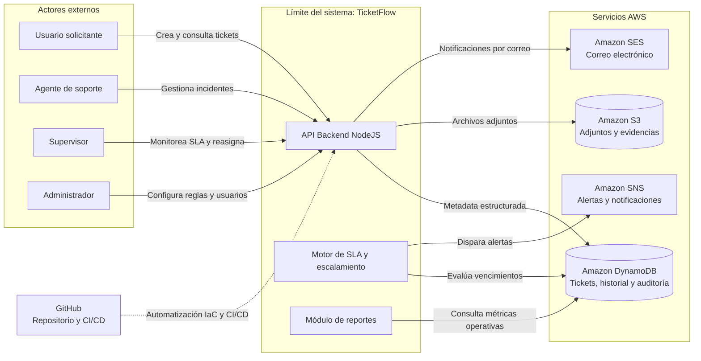

# TicketFlow — Sistema de Tickets e Incidentes
## Entrega 2: Cómputo y Datos

---

**Universidad Galileo**  
Postgrado en Diseño y Desarrollo de Software  
Infraestructura en la Nube · Ciclo Mayo–Junio 2026

**Equipo 6**  
- Francisco Magdiel Asicona Mateo — 26006399  
- Sergio Geovany García Smith — 25008130  
- Sergio Rolando Oliva del Valle — 26005694

**Fecha de entrega:** jueves 21 de mayo de 2026  
**Versión del documento:** 2.0

---

## Tabla de Contenidos

1. [Resumen de Cambios (E1 ➡️ E2)](#1-resumen-de-cambios-e1--e2)
2. [Resumen Ejecutivo](#2-resumen-ejecutivo)
3. [Actores del Sistema](#3-actores-del-sistema)
4. [Casos de Uso Priorizados](#4-casos-de-uso-priorizados)
5. [Funcionalidades Específicas del Proyecto](#5-funcionalidades-específicas-del-proyecto)
6. [Mockups del Frontend](#6-mockups-del-frontend)
7. [Diagrama de Contexto](#7-diagrama-de-contexto)
8. [Decisión de Cómputo](#8-decisión-de-cómputo)
9. [Modelo de Datos](#9-modelo-de-datos)
10. [Mapeo a Conceptos del Curso](#10-mapeo-a-conceptos-del-curso)
11. [Scope (In/Out)](#11-scope-inout)
12. [Preguntas Abiertas](#12-preguntas-abiertas)
13. [Anexo IA](#13-anexo-ia)

---

## 1. Resumen de Cambios (E1 ➡️ E2)

*(Esta sección se completará formalmente para registrar las modificaciones de E1 con base en la retroalimentación).*

---

## 2. Resumen Ejecutivo

En la actualidad compañias de diversos sectores enfrentan un problema recurrente: los incidentes operativos y solicitudes de soporte se gestionan a través de canales dispersos (correo, Slack, llamadas) sin trazabilidad, sin SLAs definidos y sin visibilidad para la gerencia. El resultado es que los problemas críticos se pierden entre ruido, los tiempos de respuesta son inconsistentes y es imposible medir la calidad del soporte.

**TicketFlow** es un sistema backend de gestión de tickets e incidentes diseñado para equipos que busquen una trazabilidad y ejecucion optima de sus operaciones de entre 10 y 200 personas. Centraliza el registro, priorización, asignación y seguimiento de solicitudes operativas en un único sistema con SLAs configurables por prioridad, escalamiento automático cuando los tiempos se incumplen, y notificaciones multicanal (email, SMS) para mantener a los involucrados informados sin que tengan que consultar el sistema.

**Qué evita o automatiza:**
- Elimina el seguimiento manual por correo y Slack.
- Evita que las peticiones queden rezagadas o perdidas en el día a día sin que se les proporcione su debido seguimiento.
- Automatiza el escalamiento: si un ticket P1 no tiene respuesta en 2 horas, el sistema escala automáticamente al supervisor sin intervención humana.
- Genera reportes de resolución y cumplimiento de SLA sin trabajo manual del equipo.

---

## 3. Actores del Sistema

### Actores Primarios
*(Inician interacciones o son el beneficiario directo de las funcionalidades)*

| Actor | Descripción | Interacción principal |
|---|---|---|
| **Usuario final (Solicitante)** | Empleado o cliente que reporta un problema o solicita soporte | Crea tickets, adjunta evidencias, consulta el estado de su solicitud |
| **Agente de soporte** | Técnico responsable de resolver tickets asignados | Recibe asignaciones, define líneas de escalamiento, actualiza estados, agrega comentarios, cierra tickets |
| **Supervisor / Líder de equipo** | Coordina al equipo de agentes, gestiona escalamientos | Reasigna tickets, revisa métricas de su equipo, configura reglas de escalamiento |

### Actores de Soporte
*(Sistemas externos o actores secundarios que complementan el flujo)*

| Actor | Descripción | Interacción |
|---|---|---|
| **Servicio de correo electrónico** | Proveedor SMTP (ej. Amazon SES) | Envía notificaciones a usuarios, agentes y supervisores |
| **Servicio de SMS** | Proveedor de mensajería (ej. Amazon SNS) | Envía alertas críticas P1/P2 fuera de horario |
| **Administrador del sistema** | Configura categorías, SLAs, usuarios y permisos | Accede al panel de administración, gestiona la configuración global |

---

## 4. Casos de Uso Priorizados

### Priorización: P0 = Crítico para el MVP | P1 = Importante | P2 = Deseable

---

**UC-01 · P0 — Crear y enviar un ticket de soporte**

| Campo | Detalle |
|---|---|
| **ID** | UC-01 |
| **Prioridad** | P0 — Crítico para el MVP |
| **Actor** | Usuario final (Solicitante) |
| **Como** | Usuario final |
| **Quiero** | Registrar un nuevo ticket con título, descripción, categoría y adjuntos |
| **Para que** | El equipo de soporte pueda atender mi problema de manera inmediata, formal y trazable |
| **Criterio de éxito** | El ticket queda registrado con un ID único, se asigna la prioridad correspondiente, el usuario recibe confirmación por correo con el ID del ticket, y el ticket aparece en la cola del agente en menos de 30 segundos |

---

**UC-02 · P0 — Asignar y gestionar tickets**

| Campo | Detalle |
|---|---|
| **ID** | UC-02 |
| **Prioridad** | P0 — Crítico para el MVP |
| **Actor** | Agente de soporte |
| **Como** | Agente de soporte |
| **Quiero** | Recibir tickets en mi cola, actualizar su estado (En progreso → Resuelto) y agregar comentarios internos |
| **Para que** | El solicitante y el supervisor puedan ver el avance en tiempo real |
| **Criterio de éxito** | El agente puede cambiar el estado del ticket, agregar comentarios visibles al solicitante o solo internos, y el sistema registra la marca de tiempo de cada acción. El solicitante recibe una notificación automática al cambiar el estado |

---

**UC-03 · P0 — Escalamiento automático por SLA vencido**

| Campo | Detalle |
|---|---|
| **ID** | UC-03 |
| **Prioridad** | P0 — Crítico para el MVP |
| **Actor** | Supervisor / Líder de equipo |
| **Como** | Supervisor |
| **Quiero** | Que el sistema me notifique automáticamente cuando un ticket supera el tiempo de SLA sin respuesta |
| **Para que** | Ningún incidente crítico quede sin atención por olvido o sobrecarga |
| **Criterio de éxito** | El sistema evalúa tickets cada 5 minutos. Si un ticket P0 supera 2 horas sin actualización, se envía notificación al supervisor y se reasigna. El ticket queda marcado como "escalado" con registro del evento |

---

**UC-04 · P1 — Priorización automática por categoría e impacto**

| Campo | Detalle |
|---|---|
| **ID** | UC-04 |
| **Prioridad** | P1 — Importante |
| **Actor** | Agente de soporte |
| **Como** | Agente de soporte |
| **Quiero** | Que el sistema sugiera una prioridad inicial (P0–P4) basada en la categoría y palabras clave del título |
| **Para que** | Los tickets críticos no queden enterrados entre solicitudes de baja urgencia |
| **Criterio de éxito** | Al crear el ticket, el sistema sugiere una prioridad con base en reglas configurables. El agente puede ajustarla manualmente y el SLA se recalcula automáticamente |

---

**UC-05 · P1 — Portal de autoservicio para usuarios finales**

| Campo | Detalle |
|---|---|
| **ID** | UC-05 |
| **Prioridad** | P1 — Importante |
| **Actor** | Usuario final (Solicitante) |
| **Como** | Usuario final |
| **Quiero** | Ver el estado de todos mis tickets abiertos, el historial de comunicaciones y el tiempo estimado de resolución |
| **Para que** | No necesite contactar al equipo de soporte para preguntar en qué estado está mi caso |
| **Criterio de éxito** | El usuario puede autenticarse en el portal, ver todos sus tickets con estado actualizado, leer el historial de comentarios y recibir notificaciones automáticas ante cualquier cambio |

---

**UC-06 · P1 — Reportes de desempeño y cumplimiento de SLA**

| Campo | Detalle |
|---|---|
| **ID** | UC-06 |
| **Prioridad** | P1 — Importante |
| **Actor** | Supervisor / Líder de equipo |
| **Como** | Supervisor |
| **Quiero** | Acceder a reportes con métricas de tiempo de resolución, tickets por agente y porcentaje de SLA cumplido |
| **Para que** | Pueda identificar cuellos de botella y mejorar la distribución de carga |
| **Criterio de éxito** | El reporte se genera bajo demanda o de forma programada. Incluye tiempo promedio de resolución, tasa de SLA, distribución por agente y tendencia histórica. Exportable a CSV/PDF |

---

**UC-07 · P2 — Búsqueda en base de conocimiento**

| Campo | Detalle |
|---|---|
| **ID** | UC-07 |
| **Prioridad** | P2 — Deseable |
| **Actor** | Usuario final (Solicitante) |
| **Como** | Usuario final |
| **Quiero** | Buscar artículos de solución antes de crear un ticket |
| **Para que** | Pueda resolver problemas comunes de forma autónoma sin esperar a un agente |
| **Criterio de éxito** | Al iniciar la creación de un ticket, el sistema sugiere artículos relacionados con el título ingresado. Si el usuario encuentra la solución, puede descartar la creación del ticket |

---

**UC-08 · P2 — Notificaciones multicanal configurables**

| Campo | Detalle |
|---|---|
| **ID** | UC-08 |
| **Prioridad** | P2 — Deseable |
| **Actor** | Agente de soporte / Supervisor |
| **Como** | Agente o supervisor |
| **Quiero** | Configurar qué eventos me notifican por correo y cuáles por SMS |
| **Para que** | Solo reciba alertas por el canal adecuado según la urgencia |
| **Criterio de éxito** | Cada usuario configura sus preferencias por tipo de evento (asignación, escalamiento, resolución). Las notificaciones P0-P1 siempre envían SMS independientemente de las preferencias |

---

## 5. Funcionalidades Específicas del Proyecto

Estas son las funcionalidades que diferencian a TicketFlow del enunciado genérico. Lo genérico (CRUD de tickets) no se lista aquí.

### 5.1 Motor de SLA con cálculo dinámico
- Tiempos de respuesta y resolución configurables por prioridad: P0 (2h respuesta / 4h resolución), P1 (4h/8h), P2 (8h/24h), P3 (24h/72h), P4 (72h/120h).
- El reloj de SLA se pausa fuera del horario laboral configurable (ej. 8:00–18:00 en zona horaria del cliente).
- Los tickets con SLA en riesgo (>75% del tiempo consumido) se marcan visualmente en la interfaz del agente.

### 5.2 Reglas de escalamiento configurables
- Los supervisores definen reglas tipo: "Si P1 sin asignación > 30 min → notificar supervisor y reasignar al agente con menor carga".
- El escalamiento puede ocurrir en cascada: agente → supervisor → gerente, con tiempos definidos por regla.
- Cada escalamiento queda registrado en el historial del ticket con razón y timestamp.

### 5.3 Asignación inteligente por carga de trabajo
- Al crear un ticket, el sistema puede asignarlo automáticamente al agente del grupo correspondiente con menor número de tickets activos.
- Los supervisores pueden ver el mapa de carga en tiempo real y redistribuir manualmente.

### 5.4 Historial de cambios de estado y auditoría
- Cada cambio de estado, reasignación o modificación queda registrado con usuario, timestamp y valor anterior/nuevo.
- El historial es inmutable: no puede ser borrado ni editado por agentes ni supervisores.
- Los registros de auditoría son accesibles para el administrador y para reportes de compliance.

### 5.5 Adjuntos vinculados al ticket
- Los usuarios pueden adjuntar capturas de pantalla, logs y archivos al crear o actualizar un ticket.
- Los archivos se almacenan en un servicio de almacenamiento de objetos, separados de la metadata del ticket en la base de datos.
- Los adjuntos están asociados al ticket y son accesibles para agentes, supervisores and el solicitante original.

### 5.6 Comentarios internos vs. públicos
- Los agentes pueden agregar notas internas (solo visibles para el equipo de soporte) y comentarios públicos (visibles al solicitante).
- Los comentarios internos permiten coordinación entre agentes sin que el usuario final vea la conversación técnica interna.

### 5.7 Vista de cola por equipo con filtros avanzados
- Los agentes ven su cola personal y la cola del equipo con filtros por: prioridad, categoría, estado, SLA en riesgo, agente asignado.
- La cola se actualiza en tiempo casi-real (polling cada 30 segundos o WebSocket).

---

## 6. Mockups del Frontend

*(Se asume que los mockups son los mismos de la E1 y están ubicados en la carpeta docs/entrega_1/)*


---
## 7. Diagrama de Contexto

TicketFlow es una plataforma orientada a la gestión de tickets e incidentes operativos, diseñada para centralizar el registro, seguimiento, priorización y resolución de solicitudes de soporte dentro de una organización. El sistema busca eliminar procesos manuales dispersos entre correo electrónico, mensajería instantánea y hojas de cálculo, proporcionando trazabilidad completa, automatización de escalamiento y monitoreo continuo del ciclo de vida de cada incidente.

El siguiente diagrama representa el contexto general de TicketFlow y define el límite funcional del sistema dentro de la arquitectura propuesta. Su objetivo es identificar los actores externos que interactúan con la plataforma, los servicios administrados de terceros utilizados para soportar funcionalidades críticas y los principales componentes lógicos que conforman el núcleo de la aplicación.

Este nivel de representación se enfoca en comprender cómo TicketFlow se relaciona con usuarios, sistemas externos y servicios cloud, sin entrar todavía en detalles de infraestructura de red, segmentación de subnets o topología interna. 

El diagrama permite visualizar de forma clara:

- Los actores humanos que utilizan el sistema y sus principales interacciones.
- El límite del sistema TicketFlow y los componentes responsables de la lógica de negocio.
- Los servicios administrados de AWS utilizados para persistencia, almacenamiento y notificaciones.
- Las integraciones externas relacionadas con automatización y ciclo de vida del software.

Esta representación sirve como base para justificar posteriormente las decisiones de cómputo, persistencia, procesamiento asíncrono y automatización de infraestructura desarrolladas a lo largo del proyecto.



### Descripción del Contexto

Los actores principales del sistema son los usuarios solicitantes, quienes crean y consultan tickets; los agentes de soporte, responsables de atender y actualizar incidentes; los supervisores, encargados de monitorear cumplimiento de SLA, métricas operativas y reasignaciones; y los administradores, quienes gestionan reglas, configuraciones y parámetros globales de la plataforma.

Dentro del límite del sistema se encuentran los componentes centrales de TicketFlow. La API Backend desarrollada en NodeJS expone los endpoints responsables de recibir solicitudes, procesar reglas de negocio y coordinar la interacción entre los distintos servicios. El motor de SLA y escalamiento automático evalúa continuamente tiempos de atención y resolución para detectar incumplimientos y generar alertas o reasignaciones automáticas. Finalmente, el módulo de reportes permite consultar métricas operativas, indicadores de rendimiento y trazabilidad histórica de los incidentes.

Fuera del límite del sistema se encuentran los servicios administrados de AWS y plataformas externas que soportan capacidades específicas de la solución. Amazon DynamoDB es utilizado para almacenar metadata estructurada de tickets, historial de estados, auditoría y relaciones operativas de alta frecuencia. Amazon S3 funciona como repositorio de archivos adjuntos, capturas, evidencias y documentos asociados a cada incidente. Los servicios Amazon SES y Amazon SNS permiten el envío automatizado de correos, alertas y notificaciones relacionadas con cambios de estado, escalamientos y vencimientos de SLA.

Adicionalmente, GitHub actúa como plataforma de control de versiones y automatización del ciclo de vida DevOps mediante Terraform y GitHub Actions, permitiendo integrar diseño de infraestructura, despliegue automatizado y validación continua dentro del proyecto.

Este diagrama representa exclusivamente el contexto funcional y las relaciones de alto nivel del sistema. Las decisiones relacionadas con arquitectura de red, segmentación de capas, VPC, subnets, seguridad y conectividad serán desarrolladas posteriormente en la Entrega 3 del proyecto.


## 8. Decisión de Cómputo

Para la implementación del backend de TicketFlow se evaluaron tres estrategias de cómputo sobre AWS para ejecutar la aplicación NodeJS: **Amazon EC2 con Auto Scaling**, **AWS Lambda (Serverless)** y **Amazon ECS Fargate**.  

La decisión final fue utilizar **Amazon EC2** mediante Launch Templates y capacidad de crecimiento horizontal utilizando Auto Scaling Groups. Esta decisión se tomó considerando que el proyecto se encuentra en una fase MVP con un ciclo de desarrollo altamente iterativo, donde la velocidad de modificación del código, la depuración avanzada y la persistencia de procesos son prioridades más importantes que la abstracción operativa completa.

El sistema TicketFlow requiere ejecutar lógica continua relacionada al cálculo y monitoreo de SLAs, además de permitir iteraciones rápidas sobre el backend NodeJS. Debido a esto, se priorizó una arquitectura con control total sobre el runtime y el proceso de ejecución.

### 8.1 Opción Seleccionada — Amazon EC2 con Auto Scaling

La arquitectura seleccionada consiste en desplegar el backend NodeJS sobre instancias EC2 Linux administradas mediante Launch Templates y Auto Scaling Groups.  

El uso de Launch Templates permite definir una configuración reutilizable para las instancias (AMI, tipo de instancia, IAM Role, Security Groups y bootstrap scripts), mientras que Auto Scaling Groups permiten incrementar o disminuir la cantidad de instancias automáticamente dependiendo de métricas como utilización de CPU o tráfico de red.

Este enfoque proporciona un entorno persistente de ejecución donde el proceso de NodeJS permanece activo continuamente, lo cual es especialmente importante para los procesos internos de monitoreo de SLA y tareas de larga duración.

Adicionalmente, EC2 habilita un entorno de depuración mucho más flexible para el equipo de desarrollo:

- Conexión segura mediante AWS Systems Manager (SSM) sin necesidad de exponer SSH públicamente.
- Uso de herramientas como PM2, Nodemon o `node inspect` para depuración en tiempo real.
- Recarga instantánea del backend sin necesidad de reconstruir imágenes o desplegar artefactos completos.
- Acceso completo al sistema operativo para diagnóstico y observabilidad avanzada.

### 8.2 Trade-offs de la Decisión

La selección de EC2 implica aceptar ciertos trade-offs arquitectónicos frente a alternativas completamente administradas o serverless.

#### Trade-off 1 — Mayor control operativo vs. mayor responsabilidad administrativa

EC2 proporciona control total sobre el entorno de ejecución, networking y procesos del sistema operativo. Esto facilita enormemente la depuración avanzada y el ajuste fino del runtime de NodeJS.

Sin embargo, este control también implica mayor responsabilidad operativa:

- Administración del sistema operativo.
- Actualizaciones de seguridad.
- Hardening de la instancia.
- Monitoreo de capacidad.
- Gestión del ciclo de vida de la infraestructura.

En enfoques como Lambda o Fargate, gran parte de estas responsabilidades son abstraídas por AWS.

#### Trade-off 2 — Persistencia y procesos continuos vs. elasticidad serverless inmediata

El motor de SLA de TicketFlow requiere ejecutar verificaciones continuas sobre tickets abiertos y tiempos de expiración. EC2 permite mantener procesos persistentes ejecutándose indefinidamente sin restricciones de tiempo.

Esto simplifica significativamente la implementación de loops de monitoreo y procesos background en NodeJS.

En contraste, AWS Lambda está diseñado para cargas efímeras y orientadas a eventos. Las funciones Lambda tienen un tiempo máximo de ejecución de 15 minutos y su entorno puede congelarse entre invocaciones, lo que dificulta ejecutar procesos continuos en memoria de forma confiable.

El trade-off consiste en que EC2 sacrifica parte de la elasticidad instantánea y escalado automático granular que ofrece el modelo serverless.

### 8.3 Alternativa Evaluada — AWS Lambda

AWS Lambda fue considerado inicialmente debido a sus ventajas operativas:

- No requiere administrar servidores.
- Escalado automático administrado por AWS.
- Cobro basado únicamente en ejecución.
- Alta integración con eventos nativos de AWS.

Sin embargo, fue descartado por limitaciones incompatibles con los requerimientos operativos del proyecto:

- Tiempo máximo de ejecución de 15 minutos.
- Naturaleza efímera del runtime.
- Dificultad para ejecutar loops persistentes de monitoreo SLA.
- Complejidad para depuración avanzada en tiempo real.
- Posibles latencias por cold starts en funciones poco utilizadas.

Aunque Lambda reduce significativamente la carga operativa, el modelo de ejecución orientado a eventos no se adapta correctamente a la lógica persistente requerida por TicketFlow.

### 8.4 Alternativa Evaluada — ECS Fargate

También se evaluó Amazon ECS Fargate como alternativa basada en contenedores administrados.

Fargate elimina la necesidad de administrar servidores EC2 directamente y ofrece ventajas importantes:

- Aislamiento mediante contenedores.
- Mejor portabilidad de workloads.
- Escalabilidad administrada.
- Integración con ECS y balanceadores de carga.

No obstante, para una aplicación MVP en constante iteración, Fargate introduce fricción significativa en el ciclo de desarrollo:

1. Construcción del contenedor Docker.
2. Tagueo de imágenes.
3. Push hacia Amazon ECR.
4. Actualización de Task Definitions.
5. Redeploy del servicio ECS.

Estos pasos añaden minutos de latencia para cada pequeño cambio en el backend, afectando negativamente el feedback loop del equipo y reduciendo la velocidad de experimentación y depuración.

Adicionalmente, Fargate introduce complejidad adicional en:

- Configuración de networking.
- Load Balancers.
- Service Discovery.
- Gestión de subredes privadas y públicas.

Para una etapa MVP, esta complejidad fue considerada innecesaria.

### 8.5 Desventaja Reconocida de la Solución Elegida

La principal desventaja reconocida del enfoque basado en EC2 es el costo operativo y económico superior frente a alternativas serverless.

A diferencia de AWS Lambda, donde únicamente se paga por tiempo efectivo de ejecución, una instancia EC2 permanece encendida continuamente incluso durante períodos de baja actividad o inactividad parcial.

Esto implica:

- Costos permanentes de cómputo.
- Pago continuo por capacidad provisionada.
- Costos asociados a almacenamiento EBS y monitoreo.
- Mayor riesgo de sobreaprovisionamiento.

Incluso utilizando instancias pequeñas y Auto Scaling Groups, el costo base de mantener infraestructura persistente es generalmente superior al modelo event-driven de Lambda para cargas pequeñas o intermitentes.

Sin embargo, se aceptó este costo adicional debido a que el beneficio obtenido en velocidad de desarrollo, facilidad de depuración, persistencia de procesos y simplicidad operativa para el equipo supera el ahorro económico potencial de las alternativas serverless en esta etapa del proyecto.

En futuras versiones del sistema, una evolución híbrida hacia arquitecturas basadas en contenedores o componentes serverless podría reevaluarse una vez estabilizado el producto y reducida la necesidad de iteración constante sobre el backend.

---

## 9. Modelo de Datos

El diseño del modelo de datos de **TicketFlow** responde a la necesidad de garantizar una respuesta rápida en las colas de trabajo, almacenamiento seguro y a bajo costo de archivos binarios, e inmutabilidad en el historial de auditoría. Se ha seleccionado una arquitectura híbrida de almacenamiento en la nube en AWS: **Amazon DynamoDB** para la base de datos no relacional de documentos y **Amazon S3** para el almacenamiento de archivos.

### 9.1 Justificación: Base de Datos NoSQL vs. Almacenamiento de Objetos

Para maximizar la eficiencia en costos y rendimiento, TicketFlow divide sus datos de la siguiente manera:

*   **Amazon DynamoDB (Base de Datos):** Diseñado para almacenar datos estructurados de tamaño pequeño que requieren consultas rápidas y constantes (por ejemplo, buscar un ticket por ID, listar tickets por agente o consultar el estado de resolución). DynamoDB proporciona latencias estables de un solo dígito de milisegundos a cualquier escala. Almacenar metadatos y listas compactas como logs o comentarios en DynamoDB asegura una lectura casi instantánea del estado de los tickets.
*   **Amazon S3 (Almacenamiento de Objetos):** Diseñado para guardar archivos binarios pesados (capturas de pantalla, archivos PDF, logs de incidentes y evidencias). DynamoDB tiene un límite estricto de **400 KB** por ítem y cobra de acuerdo a la capacidad de lectura/escritura consumida (que es proporcional al tamaño). Guardar imágenes directamente en la base de datos degradaría drásticamente el rendimiento y aumentaría los costos de forma exponencial. Almacenando los archivos en S3 y guardando únicamente su ruta (URL prefirmada) en DynamoDB, garantizamos un sistema escalable y óptimo en costos.

---

### 9.2 Estructura de Datos en Amazon DynamoDB

Se ha definido una única tabla principal llamada `ticketflow-tickets-dev` en DynamoDB. 

#### A. Aprovisionamiento y Capacidad
La tabla se configura bajo el modo **PAY_PER_REQUEST (On-Demand)**. Dado que TicketFlow está diseñado para empresas de entre 10 y 200 personas, el tráfico será altamente irregular: habrá picos de incidentes reportados durante el horario de oficina (8:00 AM a 6:00 PM) y una inactividad casi total por las noches y fines de semana. El modo On-Demand nos permite pagar únicamente por las solicitudes que se realizan y reduce el costo de inactividad a cero, en lugar de pagar una capacidad reservada (`PROVISIONED`) que se desperdiciaría fuera del horario laboral.

#### B. Llave Primaria de la Tabla Base
*   **Partition Key (PK):** `TicketID` (Tipo: `String`). Un identificador único de ticket auto-generado (ej: `TKT-492a-bc9e-1082`). No se define una *Sort Key* (SK) en la tabla base, lo que optimiza las consultas directas de lectura y actualización (`GetItem` y `UpdateItem`) basándose únicamente en el ID único del ticket.

#### C. Índices Secundarios Globales (GSI)
Para dar soporte al caso de uso **UC-02 (Asignación y gestión de tickets)**, donde los agentes de soporte técnico necesitan ver su cola personal de tickets de manera rápida, se ha diseñado un índice secundario global:

*   **Nombre del GSI:** `AgentTicketsIndex`
*   **Partition Key del GSI:** `AssignedAgentID` (Tipo: `String`)
*   **Sort Key del GSI:** `CreatedAt` (Tipo: `String` - formato ISO 8601)
*   **Propósito:** Permite realizar una operación de `Query` para extraer todos los tickets asignados a un agente específico en una sola llamada y ordenarlos de forma cronológica (del más reciente al más antiguo).
*   **Proyección de atributos:** Se proyectarán únicamente los campos críticos para construir el listado en la interfaz (`Status`, `Priority`, `Title`, `Category`). Esto evita que el índice ocupe el mismo tamaño que la tabla principal, ahorrando costos de almacenamiento y minimizando el uso de red.

#### D. Esquema de Atributos del Ticket (JSON Document)

Cada ítem en la tabla `ticketflow-tickets-dev` se compone del siguiente esquema de atributos:

| Atributo | Tipo DynamoDB | Descripción | Ejemplo de Valor |
|---|---|---|---|
| `TicketID` | `S` (String) | **Llave Primaria**. Identificador único del ticket. | `"TKT-2026-09a8"` |
| `Title` | `S` (String) | Título resumen del problema. | `"Error 500 al procesar pago"` |
| `Description` | `S` (String) | Descripción detallada del incidente. | `"El cliente no puede finalizar la transacción..."` |
| `Category` | `S` (String) | Categoría del sistema para clasificación. | `"Pagos / API"` |
| `Priority` | `S` (String) | Nivel de prioridad (P0 a P4). | `"P1"` |
| `Status` | `S` (String) | Estado actual del ciclo de vida del ticket. | `"IN_PROGRESS"` |
| `CreatedByID` | `S` (String) | Identificador del usuario que reportó el caso. | `"USR-9981"` |
| `AssignedAgentID` | `S` (String) | Identificador del agente a cargo. Indexado en GSI. | `"AGE-1200"` |
| `CreatedAt` | `S` (String) | Fecha de creación del ticket (Formato ISO 8601). | `"2026-05-24T18:22:33Z"` |
| `UpdatedAt` | `S` (String) | Fecha de la última modificación (ISO 8601). | `"2026-05-24T18:40:15Z"` |
| `SLAExpirationTime` | `N` (Number) | Timestamp Epoch (segundos) del vencimiento de resolución. | `1779669600` |
| `TimeToExist` | `N` (Number) | **Atributo TTL**. Epoch seconds para borrado automático. | `1811205600` (Creado + 1 año) |
| `Attachments` | `L` (List) | Lista de adjuntos. Cada elemento es un mapa con metadata de S3. | *Ver ejemplo detallado abajo* |
| `Comments` | `L` (List) | Lista de comentarios (públicos e internos). | *Ver ejemplo detallado abajo* |
| `AuditLog` | `L` (List) | Historial inmutable para auditoría y SLA. | *Ver ejemplo detallado abajo* |

#### E. Estructura de Listas Complejas (JSON Nested Attributes)

##### 1. Lista de Adjuntos (`Attachments`)
Almacena punteros a los archivos cargados de forma segura en S3:
```json
[
  {
    "AttachmentID": "ATT-001",
    "FileName": "pantalla_error.png",
    "S3Key": "tickets/TKT-2026-09a8/pantalla_error.png",
    "UploadedBy": "USR-9981",
    "UploadedAt": "2026-05-24T18:22:35Z"
  }
]
```

##### 2. Lista de Comentarios (`Comments`)
Permite dividir los comentarios públicos (visibles para el solicitante) de los internos (notas de trabajo entre agentes):
```json
[
  {
    "CommentID": "COM-001",
    "AuthorID": "USR-9981",
    "AuthorType": "SOLICITANTE",
    "Content": "Adjunto captura del error 500 que me aparece.",
    "CreatedAt": "2026-05-24T18:22:36Z",
    "IsInternal": false
  },
  {
    "CommentID": "COM-002",
    "AuthorID": "AGE-1200",
    "AuthorType": "AGENTE",
    "Content": "Revisar logs en AWS CloudWatch del backend de transacciones.",
    "CreatedAt": "2026-05-24T18:30:10Z",
    "IsInternal": true
  }
]
```

##### 3. Historial de Auditoría (`AuditLog`)
Para cumplir el requerimiento de trazabilidad de cambios (inmutable desde la perspectiva de la aplicación cliente):
```json
[
  {
    "LogID": "AUD-001",
    "Timestamp": "2026-05-24T18:22:33Z",
    "ActorID": "SYSTEM",
    "Action": "TICKET_CREATED",
    "Details": "Ticket asignado automáticamente a cola general por categoría Pagos."
  },
  {
    "LogID": "AUD-002",
    "Timestamp": "2026-05-24T18:35:00Z",
    "ActorID": "SUP-5001",
    "Action": "STATUS_CHANGED",
    "Field": "Status",
    "OldValue": "OPEN",
    "NewValue": "IN_PROGRESS"
  }
]
```

#### F. Estrategia de Purga Automática (TTL - TimeToExist)
Con el objetivo de optimizar los costos de almacenamiento a largo plazo y evitar consultas en datos históricos irrelevantes, se utilizará la funcionalidad nativa de **DynamoDB Time-To-Live (TTL)** sobre el atributo `TimeToExist`. 
*   **Funcionamiento:** Al cerrarse o resolverse un ticket, el backend calculará un tiempo de expiración correspondiente a **365 días en el futuro** (representado como un valor numérico Epoch UNIX timestamp).
*   **Acción:** Una vez que el tiempo del sistema supera el valor de `TimeToExist`, DynamoDB eliminará el registro de manera inerte e independiente en un lapso de 48 horas sin consumir rendimiento de lectura o escritura contratado de la base de datos.

---

### 9.3 Diseño de Almacenamiento en Amazon S3

Los adjuntos del sistema se ubicarán en un bucket denominado `ticketflow-attachments-dev` que cuenta con la siguiente configuración:

1.  **Aislamiento y Prefijo:** Todos los adjuntos asociados a tickets se organizarán bajo la ruta virtual/prefijo `tickets/{TicketID}/`.
2.  **Versionamiento:** Habilitado de forma obligatoria en el bucket. Si un usuario sube un archivo con el mismo nombre que uno existente, S3 creará una versión nueva del objeto en lugar de sobreescribirlo, garantizando la trazabilidad histórica de evidencias del caso.
3.  **Reglas de Ciclo de Vida (Lifecycle Rules):**
    *   **Ámbito (Scope):** Acotado de forma específica al prefijo `tickets/` para proteger la persistencia de configuraciones globales del bucket.
    *   **Transición a Infrequent Access (Standard-IA):** Transcurridos **30 días** desde la creación del archivo, el objeto se transfiere a Standard-IA para reducir el costo por GB, previendo que tras un mes de creado el ticket la probabilidad de consultar la captura de pantalla disminuye considerablemente.
    *   **Transición a Glacier Flexible Retrieval:** A los **90 días**, el archivo se transfiere a una capa de archivado de largo plazo (Glacier), ideal para auditorías de cumplimiento legal o ITIL.
    *   **Expiración definitiva:** Transcurridos **365 días (1 año)**, el objeto se elimina de forma permanente, coincidiendo con la expiración del ticket en DynamoDB.
4.  **Seguridad y Cifrado:**
    *   **Cifrado en reposo:** Configurado con Server-Side Encryption con claves manejadas por S3 (SSE-S3 - algoritmo AES256).
    *   **Cifrado en tránsito:** Directiva SSL-Only aplicada mediante una política de bucket (`Bucket Policy`) que rechaza de manera explícita cualquier petición HTTP que no use HTTPS (evaluando la variable de condición `aws:SecureTransport` establecida en `false`).
    *   **Acceso público bloqueado:** Bloqueo total de accesos públicos a nivel de bucket. La aplicación generará **URLs pre-firmadas** con una validez temporal máxima de 15 minutos para permitir que el frontend del solicitante o del agente descargue el adjunto de forma segura sin exponer el bucket.

---

### 9.4 Justificación de la Estrategia de Caché

Para la fase de diseño inicial de TicketFlow se ha decidido **NO implementar una capa de almacenamiento en caché** (como Amazon ElastiCache Redis o DynamoDB Accelerator - DAX):

*   **Razón Operativa:** El sistema tiene un público objetivo acotado (10-200 usuarios concurrentes internos y externos) con un flujo de transacciones bajo. DynamoDB por sí solo proporciona tiempos de respuesta inferiores a los 10 milisegundos para operaciones de lectura simples.
*   **Complejidad vs. Beneficio:** Agregar Redis o DAX a la arquitectura incrementaría la complejidad de la infraestructura en Terraform, la lógica del backend para invalidar caché cuando hay cambios de estado, y agregaría un costo fijo mínimo mensual significativo (por la provisión de instancias de caché de forma continua). En esta fase del proyecto, una capa de caché no generaría un beneficio perceptible para los usuarios y violaría el principio de simplicidad arquitectónica.

---

## 10. Mapeo a Conceptos del Curso

*(Se mantiene el mapeo inicial de la E1 como referencia básica)*

---

## 11. Scope (In/Out)

### ✅ Dentro del scope
*(Mismos elementos que E1)*

### ❌ Fuera del scope (versión 1)
*(Mismos elementos que E1)*

---

## 12. Preguntas Abiertas

*(Se actualizará indicando las preguntas técnicas resueltas en esta entrega y cuáles quedan pendientes).*

---

## 13. Anexo IA

Durante el desarrollo de la Entrega 2 se utilizó inteligencia artificial como herramienta de apoyo para explorar decisiones arquitectónicas, validar trade-offs técnicos y analizar el impacto operativo de distintas alternativas de infraestructura en AWS.

El principal enfoque técnico explorado mediante IA estuvo relacionado con la selección de la plataforma de cómputo para ejecutar el backend NodeJS de TicketFlow. Específicamente, se analizaron escenarios utilizando:

- Amazon ECS Fargate.

La exploración con IA se enfocó particularmente en comprender las implicaciones reales de adoptar una arquitectura basada en contenedores utilizando Amazon ECS Fargate durante una etapa temprana y altamente iterativa del proyecto.

La herramienta de IA permitió modelar distintos escenarios operativos y de desarrollo considerando factores como:

- frecuencia de despliegues,
- velocidad de iteración del código,
- complejidad de depuración,
- persistencia de procesos,
- tiempos de retroalimentación del equipo,
- complejidad de networking,
- y esfuerzo operativo asociado a pipelines de contenedores.

A través de estas simulaciones y análisis se concluyó que, aunque Fargate representa una solución moderna y altamente administrada para workloads contenerizados, su adopción temprana en un proyecto con alta volatilidad funcional podía introducir fricción significativa en el ciclo de desarrollo.

La IA ayudó a evaluar el impacto técnico de que cada pequeño cambio en el backend requiriera un flujo completo de contenerización, incluyendo:

1. Construcción de imágenes Docker.
2. Tagueo y versionado de imágenes.
3. Publicación hacia Amazon ECR.
4. Actualización de Task Definitions.
5. Redeploy del servicio ECS/Fargate.
6. Espera de estabilización del servicio y health checks.

Se analizó que este proceso añade varios minutos de latencia para cada modificación del código, lo cual afecta negativamente el feedback loop del equipo de desarrollo.

Debido a que TicketFlow se encuentra en una etapa MVP, se prevé que el backend requiera múltiples iteraciones rápidas antes de alcanzar estabilidad funcional. Esto implica realizar cambios frecuentes sobre reglas de negocio, cálculos de SLA, lógica de escalamiento y manejo de estados de tickets. En este contexto, reducir el tiempo entre modificar código y validar resultados se consideró crítico.

La IA también permitió explorar escenarios de depuración avanzada sobre ECS Fargate y los retos asociados a diagnosticar problemas en entornos contenerizados cuando todavía no existe un dominio profundo del comportamiento interno de la aplicación.

Entre los factores identificados se encuentran:

- necesidad de inspeccionar logs distribuidos,
- complejidad de tracing entre contenedores,
- dificultad para adjuntar herramientas interactivas de depuración,
- dependencia de pipelines de CI/CD más elaborados,
- y mayor complejidad para aislar errores relacionados con networking o configuración de tareas ECS.

Adicionalmente, se evaluó cómo la abstracción operativa de Fargate puede simplificar la administración de infraestructura en etapas maduras del producto, pero al mismo tiempo dificultar la observabilidad y experimentación rápida durante fases tempranas de desarrollo.

La IA fue utilizada como herramienta de análisis comparativo para identificar estos trade-offs y estimar el impacto operativo de cada decisión antes de implementarla. Esto permitió al equipo justificar técnicamente la selección de EC2 como plataforma inicial de cómputo, priorizando velocidad de iteración, simplicidad de depuración y persistencia de procesos sobre optimizaciones operativas avanzadas orientadas a entornos de producción maduros.
