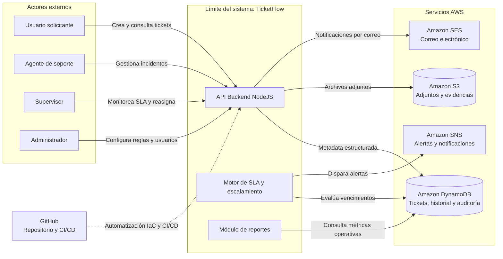
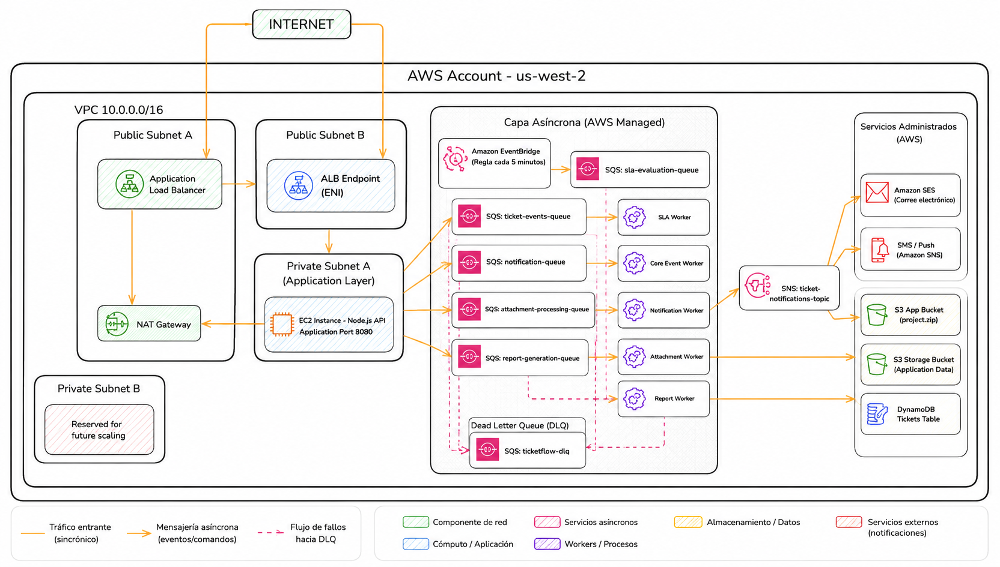

# TicketFlow — Sistema de Tickets e Incidentes
## Entrega 4: Procesamiento Asíncrono

---

**Universidad Galileo**  
Postgrado en Diseño y Desarrollo de Software  
Infraestructura en la Nube · Ciclo Mayo–Junio 2026

**Equipo 6**  
- Francisco Magdiel Asicona Mateo — 26006399  
- Sergio Geovany García Smith — 25008130  
- Sergio Rolando Oliva del Valle — 26005694

**Fecha de entrega:** domingo 7 de junio de 2026  
**Versión del documento:** 4.0

---

## Tabla de Contenidos

1. [Resumen de Cambios (E1 ➡️ E2)](#1-resumen-de-cambios-e1--e2)
2. [Resumen Ejecutivo](#2-resumen-ejecutivo)
3. [Actores del Sistema](#3-actores-del-sistema)
4. [Casos de Uso Priorizados](#4-casos-de-uso-priorizados)
5. [Funcionalidades Específicas del Proyecto](#5-funcionalidades-específicas-del-proyecto)
6. [Mockups del Frontend](#6-mockups-del-frontend)
7. [Diagrama de Contexto](#7-diagrama-de-contexto)
8. [Decisión de Cómputo](#8-decisión-de-cómputo)
9. [Modelo de Datos](#9-modelo-de-datos)
10. [Mapeo a Conceptos del Curso](#10-mapeo-a-conceptos-del-curso)
11. [Scope (In/Out)](#11-scope-inout)
12. [Preguntas Abiertas E2](#12-preguntas-abiertas)
13. [Anexo IA E2](#13-anexo-ia)
14. [Resumen de Cambios (E2 ➡️ E3)](#14-resumen-de-cambios-e2-e3)
15. [Diagrama de Contenedores (Primera Versión)](#15-diagrama-de-contenedores-primera-versión)
16. [Diseño de Red](#16-diseño-de-red)
17. [Preguntas Abiertas](#17-preguntas-abiertas-e3)
18. [Anexo IA E3](#18-anexo-ia-e3)
19. [Resumen de Cambios (E3 ➡️ E4)](#19-resumen-de-cambios-e3--e4)
20. [Diagrama de Contenedores Actualizado](#20-diagrama-de-contenedores-actualizado)
21. [Diseño de Flujos Asíncronos](#21-diseño-de-flujos-asíncronos)
22. [Manejo de Fallos, DLQ e Idempotencia](#22-manejo-de-fallos-dlq-e-idempotencia)
23. [Preguntas Abiertas E4](#23-preguntas-abiertas-e4)
24. [Anexo IA E4](#24-anexo-ia-e4)

---

## 1 Resumen de Cambios (E1 ➡️ E2)

*(Esta sección se completará formalmente para registrar las modificaciones de E1 con base en la retroalimentación).*

---

## 2. Resumen Ejecutivo

En la actualidad compañias de diversos sectores enfrentan un problema recurrente: los incidentes operativos y solicitudes de soporte se gestionan a través de canales dispersos (correo, Slack, llamadas) sin trazabilidad, sin SLAs definidos y sin visibilidad para la gerencia. El resultado es que los problemas críticos se pierden entre ruido, los tiempos de respuesta son inconsistentes y es imposible medir la calidad del soporte.

**TicketFlow** es un sistema backend de gestión de tickets e incidentes diseñado para equipos que busquen una trazabilidad y ejecucion optima de sus operaciones de entre 10 y 200 personas. Centraliza el registro, priorización, asignación y seguimiento de solicitudes operativas en un único sistema con SLAs configurables por prioridad, escalamiento automático cuando los tiempos se incumplen, y notificaciones multicanal (email, SMS) para mantener a los involucrados informados sin que tengan que consultar el sistema.

**Qué evita o automatiza:**
- Elimina el seguimiento manual por correo y Slack.
- Evita que las peticiones queden rezagadas o perdidas en el día a día sin que se les proporcione su debido seguimiento.
- Automatiza el escalamiento: si un ticket P1 no tiene respuesta en 2 horas, el sistema escala automáticamente al supervisor sin intervención humana.
- Genera reportes de resolución y cumplimiento de SLA sin trabajo manual del equipo.

---

## 3. Actores del Sistema

### Actores Primarios
*(Inician interacciones o son el beneficiario directo de las funcionalidades)*

| Actor | Descripción | Interacción principal |
|---|---|---|
| **Usuario final (Solicitante)** | Empleado o cliente que reporta un problema o solicita soporte | Crea tickets, adjunta evidencias, consulta el estado de su solicitud |
| **Agente de soporte** | Técnico responsable de resolver tickets asignados | Recibe asignaciones, define líneas de escalamiento, actualiza estados, agrega comentarios, cierra tickets |
| **Supervisor / Líder de equipo** | Coordina al equipo de agentes, gestiona escalamientos | Reasigna tickets, revisa métricas de su equipo, configura reglas de escalamiento |

### Actores de Soporte
*(Sistemas externos o actores secundarios que complementan el flujo)*

| Actor | Descripción | Interacción |
|---|---|---|
| **Servicio de correo electrónico** | Proveedor SMTP (ej. Amazon SES) | Envía notificaciones a usuarios, agentes y supervisores |
| **Servicio de SMS** | Proveedor de mensajería (ej. Amazon SNS) | Envía alertas críticas P1/P2 fuera de horario |
| **Administrador del sistema** | Configura categorías, SLAs, usuarios y permisos | Accede al panel de administración, gestiona la configuración global |

---

## 4. Casos de Uso Priorizados

### Priorización: P0 = Crítico para el MVP | P1 = Importante | P2 = Deseable

---

**UC-01 · P0 — Crear y enviar un ticket de soporte**

| Campo | Detalle |
|---|---|
| **ID** | UC-01 |
| **Prioridad** | P0 — Crítico para el MVP |
| **Actor** | Usuario final (Solicitante) |
| **Como** | Usuario final |
| **Quiero** | Registrar un nuevo ticket con título, descripción, categoría y adjuntos |
| **Para que** | El equipo de soporte pueda atender mi problema de manera inmediata, formal y trazable |
| **Criterio de éxito** | El ticket queda registrado con un ID único, se asigna la prioridad correspondiente, el usuario recibe confirmación por correo con el ID del ticket, y el ticket aparece en la cola del agente en menos de 30 segundos |

---

**UC-02 · P0 — Asignar y gestionar tickets**

| Campo | Detalle |
|---|---|
| **ID** | UC-02 |
| **Prioridad** | P0 — Crítico para el MVP |
| **Actor** | Agente de soporte |
| **Como** | Agente de soporte |
| **Quiero** | Recibir tickets en mi cola, actualizar su estado (En progreso → Resuelto) y agregar comentarios internos |
| **Para que** | El solicitante y el supervisor puedan ver el avance en tiempo real |
| **Criterio de éxito** | El agente puede cambiar el estado del ticket, agregar comentarios visibles al solicitante o solo internos, y el sistema registra la marca de tiempo de cada acción. El solicitante recibe una notificación automática al cambiar el estado |

---

**UC-03 · P0 — Escalamiento automático por SLA vencido**

| Campo | Detalle |
|---|---|
| **ID** | UC-03 |
| **Prioridad** | P0 — Crítico para el MVP |
| **Actor** | Supervisor / Líder de equipo |
| **Como** | Supervisor |
| **Quiero** | Que el sistema me notifique automáticamente cuando un ticket supera el tiempo de SLA sin respuesta |
| **Para que** | Ningún incidente crítico quede sin atención por olvido o sobrecarga |
| **Criterio de éxito** | El sistema evalúa tickets cada 5 minutos. Si un ticket P0 supera 2 horas sin actualización, se envía notificación al supervisor y se reasigna. El ticket queda marcado como "escalado" con registro del evento |

---

**UC-04 · P1 — Priorización automática por categoría e impacto**

| Campo | Detalle |
|---|---|
| **ID** | UC-04 |
| **Prioridad** | P1 — Importante |
| **Actor** | Agente de soporte |
| **Como** | Agente de soporte |
| **Quiero** | Que el sistema sugiera una prioridad inicial (P0–P4) basada en la categoría y palabras clave del título |
| **Para que** | Los tickets críticos no queden enterrados entre solicitudes de baja urgencia |
| **Criterio de éxito** | Al crear el ticket, el sistema sugiere una prioridad con base en reglas configurables. El agente puede ajustarla manualmente y el SLA se recalcula automáticamente |

---

**UC-05 · P1 — Portal de autoservicio para usuarios finales**

| Campo | Detalle |
|---|---|
| **ID** | UC-05 |
| **Prioridad** | P1 — Importante |
| **Actor** | Usuario final (Solicitante) |
| **Como** | Usuario final |
| **Quiero** | Ver el estado de todos mis tickets abiertos, el historial de comunicaciones y el tiempo estimado de resolución |
| **Para que** | No necesite contactar al equipo de soporte para preguntar en qué estado está mi caso |
| **Criterio de éxito** | El usuario puede autenticarse en el portal, ver todos sus tickets con estado actualizado, leer el historial de comentarios y recibir notificaciones automáticas ante cualquier cambio |

---

**UC-06 · P1 — Reportes de desempeño y cumplimiento de SLA**

| Campo | Detalle |
|---|---|
| **ID** | UC-06 |
| **Prioridad** | P1 — Importante |
| **Actor** | Supervisor / Líder de equipo |
| **Como** | Supervisor |
| **Quiero** | Acceder a reportes con métricas de tiempo de resolución, tickets por agente y porcentaje de SLA cumplido |
| **Para que** | Pueda identificar cuellos de botella y mejorar la distribución de carga |
| **Criterio de éxito** | El reporte se genera bajo demanda o de forma programada. Incluye tiempo promedio de resolución, tasa de SLA, distribución por agente y tendencia histórica. Exportable a CSV/PDF |

---

**UC-07 · P2 — Búsqueda en base de conocimiento**

| Campo | Detalle |
|---|---|
| **ID** | UC-07 |
| **Prioridad** | P2 — Deseable |
| **Actor** | Usuario final (Solicitante) |
| **Como** | Usuario final |
| **Quiero** | Buscar artículos de solución antes de crear un ticket |
| **Para que** | Pueda resolver problemas comunes de forma autónoma sin esperar a un agente |
| **Criterio de éxito** | Al iniciar la creación de un ticket, el sistema sugiere artículos relacionados con el título ingresado. Si el usuario encuentra la solución, puede descartar la creación del ticket |

---

**UC-08 · P2 — Notificaciones multicanal configurables**

| Campo | Detalle |
|---|---|
| **ID** | UC-08 |
| **Prioridad** | P2 — Deseable |
| **Actor** | Agente de soporte / Supervisor |
| **Como** | Agente o supervisor |
| **Quiero** | Configurar qué eventos me notifican por correo y cuáles por SMS |
| **Para que** | Solo reciba alertas por el canal adecuado según la urgencia |
| **Criterio de éxito** | Cada usuario configura sus preferencias por tipo de evento (asignación, escalamiento, resolución). Las notificaciones P0-P1 siempre envían SMS independientemente de las preferencias |

---

## 5. Funcionalidades Específicas del Proyecto

Estas son las funcionalidades que diferencian a TicketFlow del enunciado genérico. Lo genérico (CRUD de tickets) no se lista aquí.

### 5.1 Motor de SLA con cálculo dinámico
- Tiempos de respuesta y resolución configurables por prioridad: P0 (2h respuesta / 4h resolución), P1 (4h/8h), P2 (8h/24h), P3 (24h/72h), P4 (72h/120h).
- El reloj de SLA se pausa fuera del horario laboral configurable (ej. 8:00–18:00 en zona horaria del cliente).
- Los tickets con SLA en riesgo (>75% del tiempo consumido) se marcan visualmente en la interfaz del agente.

### 5.2 Reglas de escalamiento configurables
- Los supervisores definen reglas tipo: "Si P1 sin asignación > 30 min → notificar supervisor y reasignar al agente con menor carga".
- El escalamiento puede ocurrir en cascada: agente → supervisor → gerente, con tiempos definidos por regla.
- Cada escalamiento queda registrado en el historial del ticket con razón y timestamp.

### 5.3 Asignación inteligente por carga de trabajo
- Al crear un ticket, el sistema puede asignarlo automáticamente al agente del grupo correspondiente con menor número de tickets activos.
- Los supervisores pueden ver el mapa de carga en tiempo real y redistribuir manualmente.

### 5.4 Historial de cambios de estado y auditoría
- Cada cambio de estado, reasignación o modificación queda registrado con usuario, timestamp y valor anterior/nuevo.
- El historial es inmutable: no puede ser borrado ni editado por agentes ni supervisores.
- Los registros de auditoría son accesibles para el administrador y para reportes de compliance.

### 5.5 Adjuntos vinculados al ticket
- Los usuarios pueden adjuntar capturas de pantalla, logs y archivos al crear o actualizar un ticket.
- Los archivos se almacenan en un servicio de almacenamiento de objetos, separados de la metadata del ticket en la base de datos.
- Los adjuntos están asociados al ticket y son accesibles para agentes, supervisores and el solicitante original.

### 5.6 Comentarios internos vs. públicos
- Los agentes pueden agregar notas internas (solo visibles para el equipo de soporte) y comentarios públicos (visibles al solicitante).
- Los comentarios internos permiten coordinación entre agentes sin que el usuario final vea la conversación técnica interna.

### 5.7 Vista de cola por equipo con filtros avanzados
- Los agentes ven su cola personal y la cola del equipo con filtros por: prioridad, categoría, estado, SLA en riesgo, agente asignado.
- La cola se actualiza en tiempo casi-real (polling cada 30 segundos o WebSocket).

---

## 6. Mockups del Frontend

*(Se asume que los mockups son los mismos de la E1 y están ubicados en la carpeta docs/entrega_1/)*


---
## 7. Diagrama de Contexto

TicketFlow es una plataforma orientada a la gestión de tickets e incidentes operativos, diseñada para centralizar el registro, seguimiento, priorización y resolución de solicitudes de soporte dentro de una organización. El sistema busca eliminar procesos manuales dispersos entre correo electrónico, mensajería instantánea y hojas de cálculo, proporcionando trazabilidad completa, automatización de escalamiento y monitoreo continuo del ciclo de vida de cada incidente.

El siguiente diagrama representa el contexto general de TicketFlow y define el límite funcional del sistema dentro de la arquitectura propuesta. Su objetivo es identificar los actores externos que interactúan con la plataforma, los servicios administrados de terceros utilizados para soportar funcionalidades críticas y los principales componentes lógicos que conforman el núcleo de la aplicación.

Este nivel de representación se enfoca en comprender cómo TicketFlow se relaciona con usuarios, sistemas externos y servicios cloud, sin entrar todavía en detalles de infraestructura de red, segmentación de subnets o topología interna. 

El diagrama permite visualizar de forma clara:

- Los actores humanos que utilizan el sistema y sus principales interacciones.
- El límite del sistema TicketFlow y los componentes responsables de la lógica de negocio.
- Los servicios administrados de AWS utilizados para persistencia, almacenamiento y notificaciones.
- Las integraciones externas relacionadas con automatización y ciclo de vida del software.

Esta representación sirve como base para justificar posteriormente las decisiones de cómputo, persistencia, procesamiento asíncrono y automatización de infraestructura desarrolladas a lo largo del proyecto.



### Descripción del Contexto

Los actores principales del sistema son los usuarios solicitantes, quienes crean y consultan tickets; los agentes de soporte, responsables de atender y actualizar incidentes; los supervisores, encargados de monitorear cumplimiento de SLA, métricas operativas y reasignaciones; y los administradores, quienes gestionan reglas, configuraciones y parámetros globales de la plataforma.

Dentro del límite del sistema se encuentran los componentes centrales de TicketFlow. La API Backend desarrollada en NodeJS expone los endpoints responsables de recibir solicitudes, procesar reglas de negocio y coordinar la interacción entre los distintos servicios. El motor de SLA y escalamiento automático evalúa continuamente tiempos de atención y resolución para detectar incumplimientos y generar alertas o reasignaciones automáticas. Finalmente, el módulo de reportes permite consultar métricas operativas, indicadores de rendimiento y trazabilidad histórica de los incidentes.

Fuera del límite del sistema se encuentran los servicios administrados de AWS y plataformas externas que soportan capacidades específicas de la solución. Amazon DynamoDB es utilizado para almacenar metadata estructurada de tickets, historial de estados, auditoría y relaciones operativas de alta frecuencia. Amazon S3 funciona como repositorio de archivos adjuntos, capturas, evidencias y documentos asociados a cada incidente. Los servicios Amazon SES y Amazon SNS permiten el envío automatizado de correos, alertas y notificaciones relacionadas con cambios de estado, escalamientos y vencimientos de SLA.

Adicionalmente, GitHub actúa como plataforma de control de versiones y automatización del ciclo de vida DevOps mediante Terraform y GitHub Actions, permitiendo integrar diseño de infraestructura, despliegue automatizado y validación continua dentro del proyecto.

Este diagrama representa exclusivamente el contexto funcional y las relaciones de alto nivel del sistema. Las decisiones relacionadas con arquitectura de red, segmentación de capas, VPC, subnets, seguridad y conectividad serán desarrolladas posteriormente en la Entrega 3 del proyecto.

---

## 8. Decisión de Cómputo

Para la implementación del backend de TicketFlow se evaluaron tres estrategias de cómputo sobre AWS para ejecutar la aplicación NodeJS: **Amazon EC2 con Auto Scaling**, **AWS Lambda (Serverless)** y **Amazon ECS Fargate**.  

La decisión final fue utilizar **Amazon EC2** mediante Launch Templates y capacidad de crecimiento horizontal utilizando Auto Scaling Groups. Esta decisión se tomó considerando que el proyecto se encuentra en una fase MVP con un ciclo de desarrollo altamente iterativo, donde la velocidad de modificación del código, la depuración avanzada y la persistencia de procesos son prioridades más importantes que la abstracción operativa completa.

El sistema TicketFlow requiere ejecutar lógica continua relacionada al cálculo y monitoreo de SLAs, además de permitir iteraciones rápidas sobre el backend NodeJS. Debido a esto, se priorizó una arquitectura con control total sobre el runtime y el proceso de ejecución.

### 8.1 Opción Seleccionada — Amazon EC2 con Auto Scaling

La arquitectura seleccionada consiste en desplegar el backend NodeJS sobre instancias EC2 Linux administradas mediante Launch Templates y Auto Scaling Groups.  

El uso de Launch Templates permite definir una configuración reutilizable para las instancias (AMI, tipo de instancia, IAM Role, Security Groups y bootstrap scripts), mientras que Auto Scaling Groups permiten incrementar o disminuir la cantidad de instancias automáticamente dependiendo de métricas como utilización de CPU o tráfico de red.

Este enfoque proporciona un entorno persistente de ejecución donde el proceso de NodeJS permanece activo continuamente, lo cual es especialmente importante para los procesos internos de monitoreo de SLA y tareas de larga duración.

Adicionalmente, EC2 habilita un entorno de depuración mucho más flexible para el equipo de desarrollo:

- Conexión segura mediante AWS Systems Manager (SSM) sin necesidad de exponer SSH públicamente.
- Uso de herramientas como PM2, Nodemon o `node inspect` para depuración en tiempo real.
- Recarga instantánea del backend sin necesidad de reconstruir imágenes o desplegar artefactos completos.
- Acceso completo al sistema operativo para diagnóstico y observabilidad avanzada.

### 8.2 Trade-offs de la Decisión

La selección de EC2 implica aceptar ciertos trade-offs arquitectónicos frente a alternativas completamente administradas o serverless.

#### Trade-off 1 — Mayor control operativo vs. mayor responsabilidad administrativa

EC2 proporciona control total sobre el entorno de ejecución, networking y procesos del sistema operativo. Esto facilita enormemente la depuración avanzada y el ajuste fino del runtime de NodeJS.

Sin embargo, este control también implica mayor responsabilidad operativa:

- Administración del sistema operativo.
- Actualizaciones de seguridad.
- Hardening de la instancia.
- Monitoreo de capacidad.
- Gestión del ciclo de vida de la infraestructura.

En enfoques como Lambda o Fargate, gran parte de estas responsabilidades son abstraídas por AWS.

#### Trade-off 2 — Persistencia y procesos continuos vs. elasticidad serverless inmediata

El motor de SLA de TicketFlow requiere ejecutar verificaciones continuas sobre tickets abiertos y tiempos de expiración. EC2 permite mantener procesos persistentes ejecutándose indefinidamente sin restricciones de tiempo.

Esto simplifica significativamente la implementación de loops de monitoreo y procesos background en NodeJS.

En contraste, AWS Lambda está diseñado para cargas efímeras y orientadas a eventos. Las funciones Lambda tienen un tiempo máximo de ejecución de 15 minutos y su entorno puede congelarse entre invocaciones, lo que dificulta ejecutar procesos continuos en memoria de forma confiable.

El trade-off consiste en que EC2 sacrifica parte de la elasticidad instantánea y escalado automático granular que ofrece el modelo serverless.

### 8.3 Alternativa Evaluada — AWS Lambda

AWS Lambda fue considerado inicialmente debido a sus ventajas operativas:

- No requiere administrar servidores.
- Escalado automático administrado por AWS.
- Cobro basado únicamente en ejecución.
- Alta integración con eventos nativos de AWS.

Sin embargo, fue descartado por limitaciones incompatibles con los requerimientos operativos del proyecto:

- Tiempo máximo de ejecución de 15 minutos.
- Naturaleza efímera del runtime.
- Dificultad para ejecutar loops persistentes de monitoreo SLA.
- Complejidad para depuración avanzada en tiempo real.
- Posibles latencias por cold starts en funciones poco utilizadas.

Aunque Lambda reduce significativamente la carga operativa, el modelo de ejecución orientado a eventos no se adapta correctamente a la lógica persistente requerida por TicketFlow.

### 8.4 Alternativa Evaluada — ECS Fargate

También se evaluó Amazon ECS Fargate como alternativa basada en contenedores administrados.

Fargate elimina la necesidad de administrar servidores EC2 directamente y ofrece ventajas importantes:

- Aislamiento mediante contenedores.
- Mejor portabilidad de workloads.
- Escalabilidad administrada.
- Integración con ECS y balanceadores de carga.

No obstante, para una aplicación MVP en constante iteración, Fargate introduce fricción significativa en el ciclo de desarrollo:

1. Construcción del contenedor Docker.
2. Tagueo de imágenes.
3. Push hacia Amazon ECR.
4. Actualización de Task Definitions.
5. Redeploy del servicio ECS.

Estos pasos añaden minutos de latencia para cada pequeño cambio en el backend, afectando negativamente el feedback loop del equipo y reduciendo la velocidad de experimentación y depuración.

Adicionalmente, Fargate introduce complejidad adicional en:

- Configuración de networking.
- Load Balancers.
- Service Discovery.
- Gestión de subredes privadas y públicas.

Para una etapa MVP, esta complejidad fue considerada innecesaria.

### 8.5 Desventaja Reconocida de la Solución Elegida

La principal desventaja reconocida del enfoque basado en EC2 es el costo operativo y económico superior frente a alternativas serverless.

A diferencia de AWS Lambda, donde únicamente se paga por tiempo efectivo de ejecución, una instancia EC2 permanece encendida continuamente incluso durante períodos de baja actividad o inactividad parcial.

Esto implica:

- Costos permanentes de cómputo.
- Pago continuo por capacidad provisionada.
- Costos asociados a almacenamiento EBS y monitoreo.
- Mayor riesgo de sobreaprovisionamiento.

Incluso utilizando instancias pequeñas y Auto Scaling Groups, el costo base de mantener infraestructura persistente es generalmente superior al modelo event-driven de Lambda para cargas pequeñas o intermitentes.

Sin embargo, se aceptó este costo adicional debido a que el beneficio obtenido en velocidad de desarrollo, facilidad de depuración, persistencia de procesos y simplicidad operativa para el equipo supera el ahorro económico potencial de las alternativas serverless en esta etapa del proyecto.

En futuras versiones del sistema, una evolución híbrida hacia arquitecturas basadas en contenedores o componentes serverless podría reevaluarse una vez estabilizado el producto y reducida la necesidad de iteración constante sobre el backend.

---

## 9. Modelo de Datos

El diseño del modelo de datos de **TicketFlow** responde a la necesidad de garantizar una respuesta rápida en las colas de trabajo, almacenamiento seguro y a bajo costo de archivos binarios, e inmutabilidad en el historial de auditoría. Se ha seleccionado una arquitectura híbrida de almacenamiento en la nube en AWS: **Amazon DynamoDB** para la base de datos no relacional de documentos y **Amazon S3** para el almacenamiento de archivos.

### 9.1 Justificación: Base de Datos NoSQL vs. Almacenamiento de Objetos

Para maximizar la eficiencia en costos y rendimiento, TicketFlow divide sus datos de la siguiente manera:

*   **Amazon DynamoDB (Base de Datos):** Diseñado para almacenar datos estructurados de tamaño pequeño que requieren consultas rápidas y constantes (por ejemplo, buscar un ticket por ID, listar tickets por agente o consultar el estado de resolución). DynamoDB proporciona latencias estables de un solo dígito de milisegundos a cualquier escala. Almacenar metadatos y listas compactas como logs o comentarios en DynamoDB asegura una lectura casi instantánea del estado de los tickets.
*   **Amazon S3 (Almacenamiento de Objetos):** Diseñado para guardar archivos binarios pesados (capturas de pantalla, archivos PDF, logs de incidentes y evidencias). DynamoDB tiene un límite estricto de **400 KB** por ítem y cobra de acuerdo a la capacidad de lectura/escritura consumida (que es proporcional al tamaño). Guardar imágenes directamente en la base de datos degradaría drásticamente el rendimiento y aumentaría los costos de forma exponencial. Almacenando los archivos en S3 y guardando únicamente su ruta (URL prefirmada) en DynamoDB, garantizamos un sistema escalable y óptimo en costos.

---

### 9.2 Estructura de Datos en Amazon DynamoDB

Se ha definido una única tabla principal llamada `ticketflow-tickets-dev` en DynamoDB. 

#### A. Aprovisionamiento y Capacidad
La tabla se configura bajo el modo **PAY_PER_REQUEST (On-Demand)**. Dado que TicketFlow está diseñado para empresas de entre 10 y 200 personas, el tráfico será altamente irregular: habrá picos de incidentes reportados durante el horario de oficina (8:00 AM a 6:00 PM) y una inactividad casi total por las noches y fines de semana. El modo On-Demand nos permite pagar únicamente por las solicitudes que se realizan y reduce el costo de inactividad a cero, en lugar de pagar una capacidad reservada (`PROVISIONED`) que se desperdiciaría fuera del horario laboral.

#### B. Llave Primaria de la Tabla Base
*   **Partition Key (PK):** `TicketID` (Tipo: `String`). Un identificador único de ticket auto-generado (ej: `TKT-492a-bc9e-1082`). No se define una *Sort Key* (SK) en la tabla base, lo que optimiza las consultas directas de lectura y actualización (`GetItem` y `UpdateItem`) basándose únicamente en el ID único del ticket.

#### C. Índices Secundarios Globales (GSI)
Para dar soporte al caso de uso **UC-02 (Asignación y gestión de tickets)**, donde los agentes de soporte técnico necesitan ver su cola personal de tickets de manera rápida, se ha diseñado un índice secundario global:

*   **Nombre del GSI:** `AgentTicketsIndex`
*   **Partition Key del GSI:** `AssignedAgentID` (Tipo: `String`)
*   **Sort Key del GSI:** `CreatedAt` (Tipo: `String` - formato ISO 8601)
*   **Propósito:** Permite realizar una operación de `Query` para extraer todos los tickets asignados a un agente específico en una sola llamada y ordenarlos de forma cronológica (del más reciente al más antiguo).
*   **Proyección de atributos:** Se proyectarán únicamente los campos críticos para construir el listado en la interfaz (`Status`, `Priority`, `Title`, `Category`). Esto evita que el índice ocupe el mismo tamaño que la tabla principal, ahorrando costos de almacenamiento y minimizando el uso de red.

#### D. Esquema de Atributos del Ticket (JSON Document)

Cada ítem en la tabla `ticketflow-tickets-dev` se compone del siguiente esquema de atributos:

| Atributo | Tipo DynamoDB | Descripción | Ejemplo de Valor |
|---|---|---|---|
| `TicketID` | `S` (String) | **Llave Primaria**. Identificador único del ticket. | `"TKT-2026-09a8"` |
| `Title` | `S` (String) | Título resumen del problema. | `"Error 500 al procesar pago"` |
| `Description` | `S` (String) | Descripción detallada del incidente. | `"El cliente no puede finalizar la transacción..."` |
| `Category` | `S` (String) | Categoría del sistema para clasificación. | `"Pagos / API"` |
| `Priority` | `S` (String) | Nivel de prioridad (P0 a P4). | `"P1"` |
| `Status` | `S` (String) | Estado actual del ciclo de vida del ticket. | `"IN_PROGRESS"` |
| `CreatedByID` | `S` (String) | Identificador del usuario que reportó el caso. | `"USR-9981"` |
| `AssignedAgentID` | `S` (String) | Identificador del agente a cargo. Indexado en GSI. | `"AGE-1200"` |
| `CreatedAt` | `S` (String) | Fecha de creación del ticket (Formato ISO 8601). | `"2026-05-24T18:22:33Z"` |
| `UpdatedAt` | `S` (String) | Fecha de la última modificación (ISO 8601). | `"2026-05-24T18:40:15Z"` |
| `SLAExpirationTime` | `N` (Number) | Timestamp Epoch (segundos) del vencimiento de resolución. | `1779669600` |
| `TimeToExist` | `N` (Number) | **Atributo TTL**. Epoch seconds para borrado automático. | `1811205600` (Creado + 1 año) |
| `Attachments` | `L` (List) | Lista de adjuntos. Cada elemento es un mapa con metadata de S3. | *Ver ejemplo detallado abajo* |
| `Comments` | `L` (List) | Lista de comentarios (públicos e internos). | *Ver ejemplo detallado abajo* |
| `AuditLog` | `L` (List) | Historial inmutable para auditoría y SLA. | *Ver ejemplo detallado abajo* |

#### E. Estructura de Listas Complejas (JSON Nested Attributes)

##### 1. Lista de Adjuntos (`Attachments`)
Almacena punteros a los archivos cargados de forma segura en S3:
```json
[
  {
    "AttachmentID": "ATT-001",
    "FileName": "pantalla_error.png",
    "S3Key": "tickets/TKT-2026-09a8/pantalla_error.png",
    "UploadedBy": "USR-9981",
    "UploadedAt": "2026-05-24T18:22:35Z"
  }
]
```

##### 2. Lista de Comentarios (`Comments`)
Permite dividir los comentarios públicos (visibles para el solicitante) de los internos (notas de trabajo entre agentes):
```json
[
  {
    "CommentID": "COM-001",
    "AuthorID": "USR-9981",
    "AuthorType": "SOLICITANTE",
    "Content": "Adjunto captura del error 500 que me aparece.",
    "CreatedAt": "2026-05-24T18:22:36Z",
    "IsInternal": false
  },
  {
    "CommentID": "COM-002",
    "AuthorID": "AGE-1200",
    "AuthorType": "AGENTE",
    "Content": "Revisar logs en AWS CloudWatch del backend de transacciones.",
    "CreatedAt": "2026-05-24T18:30:10Z",
    "IsInternal": true
  }
]
```

##### 3. Historial de Auditoría (`AuditLog`)
Para cumplir el requerimiento de trazabilidad de cambios (inmutable desde la perspectiva de la aplicación cliente):
```json
[
  {
    "LogID": "AUD-001",
    "Timestamp": "2026-05-24T18:22:33Z",
    "ActorID": "SYSTEM",
    "Action": "TICKET_CREATED",
    "Details": "Ticket asignado automáticamente a cola general por categoría Pagos."
  },
  {
    "LogID": "AUD-002",
    "Timestamp": "2026-05-24T18:35:00Z",
    "ActorID": "SUP-5001",
    "Action": "STATUS_CHANGED",
    "Field": "Status",
    "OldValue": "OPEN",
    "NewValue": "IN_PROGRESS"
  }
]
```

#### F. Estrategia de Purga Automática (TTL - TimeToExist)
Con el objetivo de optimizar los costos de almacenamiento a largo plazo y evitar consultas en datos históricos irrelevantes, se utilizará la funcionalidad nativa de **DynamoDB Time-To-Live (TTL)** sobre el atributo `TimeToExist`. 
*   **Funcionamiento:** Al cerrarse o resolverse un ticket, el backend calculará un tiempo de expiración correspondiente a **365 días en el futuro** (representado como un valor numérico Epoch UNIX timestamp).
*   **Acción:** Una vez que el tiempo del sistema supera el valor de `TimeToExist`, DynamoDB eliminará el registro de manera inerte e independiente en un lapso de 48 horas sin consumir rendimiento de lectura o escritura contratado de la base de datos.

---

### 9.3 Diseño de Almacenamiento en Amazon S3

Los adjuntos del sistema se ubicarán en un bucket denominado `ticketflow-attachments-dev` que cuenta con la siguiente configuración:

1.  **Aislamiento y Prefijo:** Todos los adjuntos asociados a tickets se organizarán bajo la ruta virtual/prefijo `tickets/{TicketID}/`.
2.  **Versionamiento:** Habilitado de forma obligatoria en el bucket. Si un usuario sube un archivo con el mismo nombre que uno existente, S3 creará una versión nueva del objeto en lugar de sobreescribirlo, garantizando la trazabilidad histórica de evidencias del caso.
3.  **Reglas de Ciclo de Vida (Lifecycle Rules):**
    *   **Ámbito (Scope):** Acotado de forma específica al prefijo `tickets/` para proteger la persistencia de configuraciones globales del bucket.
    *   **Transición a Infrequent Access (Standard-IA):** Transcurridos **30 días** desde la creación del archivo, el objeto se transfiere a Standard-IA para reducir el costo por GB, previendo que tras un mes de creado el ticket la probabilidad de consultar la captura de pantalla disminuye considerablemente.
    *   **Transición a Glacier Flexible Retrieval:** A los **90 días**, el archivo se transfiere a una capa de archivado de largo plazo (Glacier), ideal para auditorías de cumplimiento legal o ITIL.
    *   **Expiración definitiva:** Transcurridos **365 días (1 año)**, el objeto se elimina de forma permanente, coincidiendo con la expiración del ticket en DynamoDB.
4.  **Seguridad y Cifrado:**
    *   **Cifrado en reposo:** Configurado con Server-Side Encryption con claves manejadas por S3 (SSE-S3 - algoritmo AES256).
    *   **Cifrado en tránsito:** Directiva SSL-Only aplicada mediante una política de bucket (`Bucket Policy`) que rechaza de manera explícita cualquier petición HTTP que no use HTTPS (evaluando la variable de condición `aws:SecureTransport` establecida en `false`).
    *   **Acceso público bloqueado:** Bloqueo total de accesos públicos a nivel de bucket. La aplicación generará **URLs pre-firmadas** con una validez temporal máxima de 15 minutos para permitir que el frontend del solicitante o del agente descargue el adjunto de forma segura sin exponer el bucket.

---

### 9.4 Justificación de la Estrategia de Caché

Para la fase de diseño inicial de TicketFlow se ha decidido **NO implementar una capa de almacenamiento en caché** (como Amazon ElastiCache Redis o DynamoDB Accelerator - DAX):

*   **Razón Operativa:** El sistema tiene un público objetivo acotado (10-200 usuarios concurrentes internos y externos) con un flujo de transacciones bajo. DynamoDB por sí solo proporciona tiempos de respuesta inferiores a los 10 milisegundos para operaciones de lectura simples.
*   **Complejidad vs. Beneficio:** Agregar Redis o DAX a la arquitectura incrementaría la complejidad de la infraestructura en Terraform, la lógica del backend para invalidar caché cuando hay cambios de estado, y agregaría un costo fijo mínimo mensual significativo (por la provisión de instancias de caché de forma continua). En esta fase del proyecto, una capa de caché no generaría un beneficio perceptible para los usuarios y violaría el principio de simplicidad arquitectónica.

---

## 10. Mapeo a Conceptos del Curso

*(Se mantiene el mapeo inicial de la E1 como referencia básica)*

---

## 11. Scope (In/Out)

### ✅ Dentro del scope
*(Mismos elementos que E1)*

### ❌ Fuera del scope (versión 1)
*(Mismos elementos que E1)*

---

## 12. Preguntas Abiertas

*(Se actualizará indicando las preguntas técnicas resueltas en esta entrega y cuáles quedan pendientes).*

---

## 13. Anexo IA

Durante el desarrollo de la Entrega 2 se utilizó inteligencia artificial como herramienta de apoyo para explorar decisiones arquitectónicas, validar trade-offs técnicos y analizar el impacto operativo de distintas alternativas de infraestructura en AWS.

El principal enfoque técnico explorado mediante IA estuvo relacionado con la selección de la plataforma de cómputo para ejecutar el backend NodeJS de TicketFlow. Específicamente, se analizaron escenarios utilizando:

- Amazon ECS Fargate.

La exploración con IA se enfocó particularmente en comprender las implicaciones reales de adoptar una arquitectura basada en contenedores utilizando Amazon ECS Fargate durante una etapa temprana y altamente iterativa del proyecto.

La herramienta de IA permitió modelar distintos escenarios operativos y de desarrollo considerando factores como:

- frecuencia de despliegues,
- velocidad de iteración del código,
- complejidad de depuración,
- persistencia de procesos,
- tiempos de retroalimentación del equipo,
- complejidad de networking,
- y esfuerzo operativo asociado a pipelines de contenedores.

A través de estas simulaciones y análisis se concluyó que, aunque Fargate representa una solución moderna y altamente administrada para workloads contenerizados, su adopción temprana en un proyecto con alta volatilidad funcional podía introducir fricción significativa en el ciclo de desarrollo.

La IA ayudó a evaluar el impacto técnico de que cada pequeño cambio en el backend requiriera un flujo completo de contenerización, incluyendo:

1. Construcción de imágenes Docker.
2. Tagueo y versionado de imágenes.
3. Publicación hacia Amazon ECR.
4. Actualización de Task Definitions.
5. Redeploy del servicio ECS/Fargate.
6. Espera de estabilización del servicio y health checks.

Se analizó que este proceso añade varios minutos de latencia para cada modificación del código, lo cual afecta negativamente el feedback loop del equipo de desarrollo.

Debido a que TicketFlow se encuentra en una etapa MVP, se prevé que el backend requiera múltiples iteraciones rápidas antes de alcanzar estabilidad funcional. Esto implica realizar cambios frecuentes sobre reglas de negocio, cálculos de SLA, lógica de escalamiento y manejo de estados de tickets. En este contexto, reducir el tiempo entre modificar código y validar resultados se consideró crítico.

La IA también permitió explorar escenarios de depuración avanzada sobre ECS Fargate y los retos asociados a diagnosticar problemas en entornos contenerizados cuando todavía no existe un dominio profundo del comportamiento interno de la aplicación.

Entre los factores identificados se encuentran:

- necesidad de inspeccionar logs distribuidos,
- complejidad de tracing entre contenedores,
- dificultad para adjuntar herramientas interactivas de depuración,
- dependencia de pipelines de CI/CD más elaborados,
- y mayor complejidad para aislar errores relacionados con networking o configuración de tareas ECS.

Adicionalmente, se evaluó cómo la abstracción operativa de Fargate puede simplificar la administración de infraestructura en etapas maduras del producto, pero al mismo tiempo dificultar la observabilidad y experimentación rápida durante fases tempranas de desarrollo.

La IA fue utilizada como herramienta de análisis comparativo para identificar estos trade-offs y estimar el impacto operativo de cada decisión antes de implementarla. Esto permitió al equipo justificar técnicamente la selección de EC2 como plataforma inicial de cómputo, priorizando velocidad de iteración, simplicidad de depuración y persistencia de procesos sobre optimizaciones operativas avanzadas orientadas a entornos de producción maduros.

## 14. Resumen de cambios (E2-E3)

A partir de la retroalimentación y el análisis realizado durante el diseño de arquitectura, se incorporó una capa completa de red y acceso seguro a la aplicación. Los principales cambios consistieron en la creación de los módulos **network** e **ingress**, la reubicación de la instancia EC2 dentro de una subred privada y la configuración de acceso controlado hacia los servicios de almacenamiento y persistencia (Amazon S3 y DynamoDB).


### Diseño de red implementado

Se diseñó una red aislada utilizando una VPC dedicada con segmentación entre recursos públicos y privados.

**- VPC**

| Recurso            | Valor                  |
| ------------------ | ---------------------- |
| CIDR VPC           | 10.0.0.0/16            |
| Región             | us-west-2              |
| Availability Zones | us-west-2a, us-west-2b |


**- Subredes públicas**

Las subredes públicas alojan los componentes que requieren exposición a Internet.

| Subred   | Availability Zone | CIDR        |
| -------- | ----------------- | ----------- |
| Public A | us-west-2a        | 10.0.1.0/24 |
| Public B | us-west-2b        | 10.0.2.0/24 |

Estas subredes contienen:

* Application Load Balancer (ALB)
* NAT Gateway
* Conectividad hacia Internet mediante Internet Gateway


**- Subredes privadas**

Las subredes privadas alojan los componentes internos de la aplicación.

| Subred    | Availability Zone | CIDR         |
| --------- | ----------------- | ------------ |
| Private A | us-west-2a        | 10.0.11.0/24 |
| Private B | us-west-2b        | 10.0.12.0/24 |

Estas subredes están protegidas de acceso directo desde Internet y utilizan el NAT Gateway para tráfico saliente cuando es necesario.


**- Flujo de comunicación**

```text
Internet
    │
    ▼
Application Load Balancer
(Public Subnets)
    │
    ▼
EC2 NodeJS
(Private Subnet A)
    │
    ├── DynamoDB
    │
    └── S3
```


### Ajustes realizados al módulo de cómputo

**- Migración de EC2 a una subred privada**

Uno de los cambios más importantes fue mover la instancia EC2 desde un enfoque público a una arquitectura privada.

La instancia ahora se despliega en:

```text
Private Subnet A
10.0.11.0/24
```

Beneficios:

* No posee acceso directo desde Internet.
* Reduce la superficie de ataque.
* Todo acceso externo pasa obligatoriamente por el ALB.


**- Integración con el ALB**

Se agregó la asociación automática de la instancia EC2 con el Target Group mediante:

```text
aws_lb_target_group_attachment
```

Esto permite que el ALB enrute tráfico hacia la aplicación NodeJS que escucha en el puerto 8080.

---

**- Acceso seguro a S3**

Se incorporó un IAM Role asociado a la instancia EC2 mediante un Instance Profile.

Se configuraron permisos para:

### Bucket de despliegue

Permisos:

* s3:GetObject

Utilizado para descargar el artefacto de la aplicación (`project.zip`) durante el arranque de la instancia.

**- Bucket de almacenamiento**

Permisos:

* s3:ListBucket
* s3:GetObject
* s3:PutObject
* s3:DeleteObject

Permitiendo operaciones CRUD desde la aplicación.


### Acceso seguro a DynamoDB

Se agregaron permisos IAM específicos para la tabla DynamoDB.

Operaciones permitidas:

* GetItem
* PutItem
* UpdateItem
* DeleteItem
* Query
* Scan

De esta manera la aplicación puede interactuar directamente con la base de datos sin almacenar credenciales estáticas.


### Impacto sobre la arquitectura

La arquitectura evolucionó desde una solución centrada únicamente en cómputo y almacenamiento hacia una arquitectura multicapa con segmentación de red, control de acceso y separación entre componentes públicos y privados.

Las principales mejoras obtenidas fueron:

* Incorporación de una VPC dedicada.
* Segmentación mediante subredes públicas y privadas.
* Protección de la aplicación detrás de un Application Load Balancer.
* Eliminación de acceso directo a la instancia EC2.
* Acceso controlado a DynamoDB mediante IAM Roles.
* Acceso controlado a S3 mediante IAM Roles.
* Conectividad saliente segura mediante NAT Gateway.
* Preparación para futuras expansiones multi-AZ y escalamiento horizontal.

---

## 15. Diagrama de Contenedores (primera versión)

El siguiente diagrama muestra los principales componentes del sistema y su ubicación dentro de la arquitectura de red definida para el proyecto.

- El tráfico ingresa desde Internet hacia un Application Load Balancer (ALB).
- El ALB está desplegado en las subnets públicas.
- La instancia EC2 que ejecuta la aplicación Node.js reside en una subnet privada.
- DynamoDB y S3 son servicios administrados de AWS, por lo que no residen dentro de una subnet específica de la VPC, pero son consumidos por la aplicación.
- La instancia EC2 utiliza IAM Roles para acceder a DynamoDB y S3 sin almacenar credenciales.
- El NAT Gateway permite que la instancia privada descargue dependencias y acceda a servicios externos cuando sea necesario.

### Diagrama Mermaid


### Componentes principales

#### Compute
- Instancia EC2 Amazon Linux 2023 (`t4g.nano`).
- Aplicación Node.js ejecutándose en el puerto `8080`.
- Desplegada en la subnet privada `10.0.11.0/24`.
- Registrada automáticamente en el Target Group del ALB.

#### Base de datos
- Tabla DynamoDB para almacenamiento de tickets.
- Acceso mediante IAM Role asociado a la instancia EC2.
- No expone endpoints públicos dentro de la arquitectura.

#### Storage
- Bucket S3 para despliegue de la aplicación (`project.zip`).
- Bucket S3 para almacenamiento de datos de negocio.
- Acceso controlado mediante políticas IAM asignadas a la instancia EC2.

#### Ingress
- Application Load Balancer desplegado en las subnets públicas:
  - `10.0.1.0/24`
  - `10.0.2.0/24`
- Escucha tráfico HTTP en puerto 80.
- Reenvía solicitudes hacia la aplicación en puerto 8080.

#### Networking
- VPC: `10.0.0.0/16`
- Dos Availability Zones:
  - `us-west-2a`
  - `us-west-2b`
- Subnets públicas para componentes expuestos a Internet.
- Subnets privadas para la capa de aplicación.
- NAT Gateway para salida controlada a Internet desde recursos privados.

---

## 16. Diseño de Red
### Objetivo

El diseño de red propuesto busca implementar una arquitectura segura y escalable para la aplicación, separando los componentes expuestos a Internet de los recursos internos mediante el uso de subnets públicas y privadas dentro de una VPC dedicada.

### Arquitectura de Red

#### VPC

Se creó una VPC dedicada con el siguiente rango CIDR:

| Recurso | CIDR        |
| ------- | ----------- |
| VPC     | 10.0.0.0/16 |

Este rango proporciona suficiente espacio para segmentar la infraestructura en múltiples subredes y facilitar futuras expansiones.


#### Subnets

La arquitectura utiliza dos Availability Zones (AZs) para aumentar la disponibilidad y resiliencia ante fallos de infraestructura.

**Subnets Públicas**

Las subnets públicas alojan los recursos que deben ser accesibles desde Internet.

| Subnet   | CIDR        | Availability Zone | Uso              |
| -------- | ----------- | ----------------- | ---------------- |
| Public A | 10.0.1.0/24 | us-west-2a        | ALB, NAT Gateway |
| Public B | 10.0.2.0/24 | us-west-2b        | ALB              |

**Subnets Privadas**

Las subnets privadas alojan los componentes internos del sistema.

| Subnet    | CIDR         | Availability Zone | Uso                               |
| --------- | ------------ | ----------------- | --------------------------------- |
| Private A | 10.0.11.0/24 | us-west-2a        | EC2 Application                   |
| Private B | 10.0.12.0/24 | us-west-2b        | Capacidad para crecimiento futuro |


### Diagrama de Red


### Número de Availability Zones y Justificación

Se utilizaron dos Availability Zones:

* us-west-2a
* us-west-2b

#### Razones

1. Alta disponibilidad

   El Application Load Balancer requiere al menos dos subnets en diferentes Availability Zones para distribuir tráfico y mantener disponibilidad ante la caída de una zona.

2. Tolerancia a fallos

   Si una Availability Zone presenta problemas, la infraestructura de red continúa operando desde la segunda zona.

3. Escalabilidad futura

   Actualmente la aplicación utiliza una sola instancia EC2 en la subnet privada A, pero la arquitectura permite desplegar instancias adicionales en la subnet privada B sin rediseñar la red.


### Flujo de Tráfico

El tráfico sigue la siguiente ruta:

```text
Internet
    ↓
Application Load Balancer (Puerto 80)
    ↓
EC2 privada (Puerto 8080)
    ↓
DynamoDB / S3
```

La instancia EC2 no posee dirección IP pública y únicamente acepta tráfico proveniente del Load Balancer.


### Conectividad Saliente

#### Opción Implementada: NAT Gateway

La instancia EC2 se encuentra en una subnet privada y utiliza un NAT Gateway para acceder a Internet cuando es necesario.

Ejemplos:

* Descargar paquetes del sistema operativo.
* Acceder a repositorios externos.
* Obtener dependencias de software.
* Consumir APIs externas.

Flujo:

```text
EC2 privada
    ↓
NAT Gateway
    ↓
Internet Gateway
    ↓
Internet
```

---

### Alternativa Evaluada: VPC Endpoints

AWS ofrece VPC Endpoints para acceder a servicios administrados sin utilizar Internet.

Ejemplos:

* Amazon S3
* DynamoDB

Flujo:

```text
EC2 privada
    ↓
VPC Endpoint
    ↓
Servicio AWS
```


### Trade-Off: NAT Gateway vs VPC Endpoints

| Aspecto                | NAT Gateway | VPC Endpoint             |
| ---------------------- | ----------- | ------------------------ |
| Acceso a Internet      | Sí          | No                       |
| Acceso a S3            | Sí          | Sí                       |
| Acceso a DynamoDB      | Sí          | Sí                       |
| Acceso a APIs externas | Sí          | No                       |
| Seguridad              | Menor       | Mayor                    |
| Complejidad            | Menor       | Mayor                    |
| Costo para tráfico AWS | Mayor       | Menor                    |
| Flexibilidad           | Alta        | Limitada a servicios AWS |

---

### Decisión Adoptada

Para esta versión del proyecto se implementó un NAT Gateway debido a que:

* Simplifica la arquitectura.
* Permite salida a Internet para la instancia EC2.
* Facilita la instalación de dependencias y actualizaciones.
* Reduce la complejidad operativa durante el desarrollo.

Sin embargo, para un entorno productivo sería recomendable complementar o reemplazar parcialmente el NAT Gateway mediante VPC Endpoints para Amazon S3 y DynamoDB, reduciendo costos y evitando que el tráfico hacia servicios AWS salga a Internet.

--- 

## 17. Preguntas Abiertas E3

*(Se actualizará indicando las preguntas técnicas resueltas en esta entrega y cuáles quedan pendientes).*

---

## 18. Anexo IA E3
## Exploración de Diseño de Red y Patrones Descartados

### Uso de IA durante el diseño de red

Durante la elaboración de la arquitectura de infraestructura se utilizó IA como herramienta de apoyo para analizar alternativas de diseño en AWS, comprender las implicaciones de seguridad de cada componente y validar la conectividad entre los distintos servicios del proyecto.

Las sesiones de exploración se enfocaron principalmente en los siguientes temas:

* Diseño de VPC y segmentación de red.
* Uso de subnets públicas y privadas.
* Necesidad de utilizar un Application Load Balancer (ALB).
* Necesidad de utilizar un NAT Gateway.
* Comunicación entre EC2, S3 y DynamoDB.
* Seguridad mediante Security Groups e IAM Roles.
* Evaluación de alternativas de conectividad mediante VPC Endpoints.


### Exploraciones realizadas

#### 1. Diseño de la VPC

Se exploraron diferentes alternativas para estructurar la red del proyecto.

Inicialmente se analizaron dos módulos de infraestructura que contenían recursos parcialmente superpuestos. Mediante el análisis asistido por IA se identificó que el módulo de red era el que mejor respondía a los requerimientos del enunciado, ya que incluía:

* VPC con CIDR explícito.
* Subnets públicas.
* Subnets privadas.
* Internet Gateway.
* NAT Gateway.
* Route Tables.
* Asociaciones de rutas.
* Security Groups.

Esto permitió construir una arquitectura alineada con los requisitos de la entrega.

---

#### 2. Ubicación de la instancia EC2

Se evaluó inicialmente la posibilidad de desplegar la instancia EC2 en una subnet pública.

Sin embargo, la IA sugirió una arquitectura más segura donde:

* El Application Load Balancer se expone a Internet.
* La instancia EC2 permanece en una subnet privada.
* Todo el tráfico externo ingresa exclusivamente a través del ALB.

Arquitectura seleccionada:

```text
Internet
   ↓
ALB (Subnet pública)
   ↓
EC2 (Subnet privada)
```

 **Beneficios**

* La instancia EC2 no posee dirección IP pública.
* No existe acceso directo desde Internet hacia el servidor.
* Se reduce significativamente la superficie de ataque.

---

#### 3. Necesidad del Application Load Balancer

Durante la exploración se analizó si el proyecto requería realmente un ALB considerando que solo existe una instancia EC2.

La conclusión fue mantener el ALB debido a que:

* Es un requisito habitual en arquitecturas de producción.
* Permite desacoplar el punto de entrada público de la aplicación.
* Facilita futuras ampliaciones horizontales.
* Centraliza las reglas de acceso.

Además, el ALB escucha tráfico HTTP en el puerto 80 y lo redirige al puerto 8080 donde se ejecuta la aplicación Node.js.

```text
Internet
   ↓
ALB :80
   ↓
EC2 :8080
```

---

#### 4. NAT Gateway para conectividad saliente

Uno de los temas más explorados fue la necesidad de permitir que la instancia EC2, ubicada en una subnet privada, pudiera acceder a Internet.

La aplicación requiere:

* Descargar el paquete desplegado en S3.
* Instalar dependencias del sistema operativo.
* Ejecutar comandos de inicialización durante el bootstrap.
* Posibilidad futura de consumir APIs externas.

La IA explicó que una instancia privada no puede acceder directamente a Internet, por lo que se evaluaron dos alternativas:

**Alternativa A: NAT Gateway**

```text
EC2 Privada
      ↓
NAT Gateway
      ↓
Internet
```

**Alternativa B: VPC Endpoints**

```text
EC2 Privada
      ↓
VPC Endpoint
      ↓
Servicio AWS
```

Finalmente se seleccionó NAT Gateway por simplicidad y flexibilidad para el alcance actual del proyecto.

---

#### 5. Comunicación entre EC2 y S3

Inicialmente se evaluó la posibilidad de utilizar credenciales AWS almacenadas dentro de la instancia.

La IA sugirió descartar esta aproximación por motivos de seguridad.

En su lugar se implementó:

* IAM Role asociado a la instancia EC2.
* IAM Instance Profile.
* Políticas específicas para acceso a S3.

La aplicación obtiene permisos automáticamente sin almacenar claves de acceso.

**Patrón descartado**

```text
EC2
  └── Access Key
  └── Secret Key
```

**Patrón adoptado**

```text
EC2
  └── IAM Role
         └── Permisos S3
```

---

#### 6. Comunicación entre EC2 y DynamoDB

También se exploró la mejor forma de acceder a DynamoDB.

La IA sugirió reutilizar el mismo enfoque utilizado para S3:

* IAM Role.
* Políticas de mínimo privilegio.
* Acceso únicamente a la tabla requerida.

La instancia EC2 recibió permisos explícitos para:

* GetItem
* PutItem
* UpdateItem
* DeleteItem
* Query
* Scan


### Patrones sugeridos por IA que fueron descartados

#### Despliegue de EC2 en subnet pública

 **Motivo del descarte**

Aunque simplifica la conectividad, expone directamente la instancia a Internet y reduce el nivel de seguridad.


#### Acceso directo desde Internet a la aplicación en el puerto 8080

 **Motivo del descarte**

La arquitectura final exige que todo el tráfico pase primero por el Application Load Balancer.


#### Uso de credenciales AWS almacenadas en la instancia

**Motivo del descarte**

Representa una mala práctica de seguridad y dificulta la rotación de credenciales.

Se reemplazó por IAM Roles.


#### Uso exclusivo de VPC Endpoints

**Motivo del descarte**

Aunque reduce costos y mejora la seguridad para servicios AWS, no permite acceso a Internet para instalación de dependencias ni para futuras integraciones externas.

Para esta fase del proyecto se priorizó la simplicidad mediante NAT Gateway.


#### Conclusiones

La utilización de IA permitió evaluar diferentes alternativas arquitectónicas y comprender los trade-offs asociados a cada una. Como resultado, se adoptó una arquitectura basada en una VPC segmentada con subnets públicas y privadas, Application Load Balancer como punto de entrada, instancia EC2 protegida en una subnet privada, acceso controlado mediante IAM Roles y conectividad saliente a través de NAT Gateway.

Las recomendaciones de IA contribuyeron principalmente a fortalecer la seguridad del diseño, simplificar la gestión de permisos y mantener una arquitectura alineada con prácticas comunes de despliegue en AWS.

---

## 19. Resumen de Cambios (E3 ➡️ E4)

En la Entrega 4 se incorpora la capa de procesamiento asíncrono sobre la arquitectura de red definida en la Entrega 3. El sistema mantiene la misma base arquitectónica: una API NodeJS ejecutándose en EC2 dentro de una subnet privada, expuesta únicamente mediante un ALB en subnets públicas, con persistencia en Amazon DynamoDB y almacenamiento de adjuntos en Amazon S3.

El principal cambio de esta iteración consiste en separar las operaciones que no requieren respuesta inmediata del flujo síncrono de la API. Acciones como envío de notificaciones, evaluación periódica de SLA, escalamiento automático, procesamiento de adjuntos y generación de reportes se modelan ahora como eventos o comandos procesados mediante servicios administrados de mensajería.

La arquitectura incorpora Amazon SQS para colas de trabajo, Amazon SNS para fan-out de notificaciones y Amazon EventBridge para disparar procesos programados, como la evaluación de SLAs cada cinco minutos. Cada flujo asíncrono contempla manejo de fallos mediante Dead Letter Queues, políticas de reintento e idempotencia para evitar efectos duplicados ante reprocesamientos.

Este cambio permite que la API mantenga tiempos de respuesta bajos, reduzca acoplamiento entre módulos internos y prepare la plataforma para escalar procesamiento background sin afectar directamente la experiencia del usuario.

## 20. Diagrama de Contenedores Actualizado

El siguiente diagrama actualiza la arquitectura definida en la Entrega 3 incorporando la capa de procesamiento asíncrono. La API NodeJS continúa siendo el punto principal de entrada para las solicitudes HTTP, pero ahora delega operaciones no críticas o de larga duración hacia colas, tópicos y workers especializados.



### Descripción del Diagrama

La arquitectura mantiene la separación pública y privada definida en la Entrega 3. El tráfico externo ingresa únicamente por el Application Load Balancer ubicado en subnets públicas. La API NodeJS permanece en subnets privadas y no recibe tráfico directo desde Internet.

La nueva capa asíncrona agrega colas SQS especializadas para desacoplar tareas que no deben bloquear la respuesta inmediata de la API. Cuando ocurre una acción relevante, como la creación de un ticket, cambio de estado, carga de adjunto o solicitud de reporte, la API persiste primero el estado mínimo necesario en DynamoDB y luego publica un mensaje hacia la cola correspondiente.

Los workers asíncronos consumen mensajes desde las colas y ejecutan tareas específicas: envío de notificaciones, evaluación de SLA, procesamiento de adjuntos y generación de reportes. Esto permite escalar cada tipo de procesamiento de forma independiente en futuras iteraciones.

Amazon EventBridge se utiliza para ejecutar evaluaciones periódicas de SLA cada cinco minutos, reemplazando el enfoque inicial donde el backend mantenía esta lógica dentro del mismo proceso NodeJS. De esta forma, la evaluación de vencimientos deja de depender exclusivamente del ciclo de vida de la instancia EC2.

Todas las colas principales están asociadas a una Dead Letter Queue común llamada `ticketflow-dlq`, donde se almacenan mensajes que no pudieron procesarse después de varios intentos. Esto permite inspeccionar fallos sin perder eventos críticos del negocio.

## 21. Diseño de Flujos Asíncronos

La capa asíncrona de TicketFlow se diseña para desacoplar operaciones que no necesitan completarse dentro del request HTTP principal. La API NodeJS mantiene la responsabilidad de validar la solicitud, persistir el estado inicial en DynamoDB y responder al usuario. Las tareas secundarias, como notificaciones, evaluación de SLA, procesamiento de adjuntos y generación de reportes, se delegan a colas SQS y workers especializados.

Esta separación permite reducir latencia en los endpoints principales, aislar fallos de procesos secundarios y habilitar reintentos controlados sin afectar directamente la experiencia del usuario.

### 21.1 Catálogo de eventos y comandos

| Tipo | Nombre | Productor | Canal | Consumidor | Propósito |
|---|---|---|---|---|---|
| Evento | `TicketCreated` | API NodeJS | `ticket-events-queue` | Core Event Worker | Registrar acciones derivadas de la creación de un ticket y disparar notificaciones iniciales. |
| Evento | `TicketStatusChanged` | API NodeJS | `ticket-events-queue` | Core Event Worker | Procesar cambios de estado y notificar al solicitante o supervisor. |
| Evento | `TicketReassigned` | API NodeJS | `ticket-events-queue` | Core Event Worker | Notificar reasignaciones y registrar auditoría operacional. |
| Evento | `CommentAdded` | API NodeJS | `ticket-events-queue` | Core Event Worker | Notificar nuevos comentarios públicos o internos según visibilidad. |
| Comando | `SendNotificationCommand` | API NodeJS / Core Event Worker / SLA Worker | `notification-queue` | Notification Worker | Enviar correos, SMS o futuras notificaciones push. |
| Comando | `EvaluateSLACommand` | Amazon EventBridge | `sla-evaluation-queue` | SLA Worker | Evaluar tickets abiertos y detectar vencimientos o riesgos de SLA. |
| Comando | `EscalateTicketCommand` | SLA Worker | `ticket-events-queue` | Core Event Worker | Ejecutar escalamiento automático de tickets vencidos. |
| Comando | `ProcessAttachmentCommand` | API NodeJS | `attachment-processing-queue` | Attachment Worker | Validar metadata de adjuntos y asociarlos formalmente al ticket. |
| Comando | `GenerateReportCommand` | API NodeJS | `report-generation-queue` | Report Worker | Generar reportes de desempeño y cumplimiento de SLA. |

### 21.2 Distinción entre eventos y comandos

En TicketFlow se diferencia explícitamente entre eventos y comandos para mantener claridad semántica en la arquitectura.

Un **evento** representa algo que ya ocurrió dentro del sistema. Por ejemplo, `TicketCreated` indica que un ticket ya fue validado y persistido en DynamoDB. Los consumidores pueden reaccionar a este hecho generando notificaciones, auditoría extendida o métricas, pero no deben asumir que pueden impedir que el evento haya ocurrido.

Un **comando** representa una instrucción para que un componente realice una acción. Por ejemplo, `SendNotificationCommand` solicita al Notification Worker enviar un correo o SMS; `EvaluateSLACommand` ordena al SLA Worker revisar tickets abiertos; y `GenerateReportCommand` solicita construir un reporte bajo demanda.

Esta separación ayuda a evitar acoplamiento entre módulos, facilita el razonamiento sobre retries y permite que cada worker tenga una responsabilidad específica.

### 21.3 Formato de Payloads

Los mensajes intercambiados entre productores y consumidores siguen una estructura común que facilita trazabilidad, auditoría e idempotencia.

#### Evento: TicketCreated

```json
{
  "eventId": "evt-2026-000184",
  "eventType": "TicketCreated",
  "ticketId": "TKT-2026-09a8",
  "priority": "P2",
  "createdBy": "user-123",
  "occurredAt": "2026-06-07T18:30:00Z"
}
```

#### Evento: TicketStatusChanged

```json
{
  "eventId": "evt-2026-000201",
  "eventType": "TicketStatusChanged",
  "ticketId": "TKT-2026-09a8",
  "oldStatus": "IN_PROGRESS",
  "newStatus": "RESOLVED",
  "updatedBy": "agent-456",
  "occurredAt": "2026-06-07T20:15:00Z"
}
```

#### Comando: SendNotificationCommand

```json
{
  "commandId": "cmd-2026-000087",
  "commandType": "SendNotificationCommand",
  "ticketId": "TKT-2026-09a8",
  "recipient": "user@example.com",
  "channel": "EMAIL",
  "template": "ticket-created"
}
```

#### Comando: EvaluateSLACommand

```json
{
  "commandId": "cmd-2026-000091",
  "commandType": "EvaluateSLACommand",
  "executionTime": "2026-06-07T18:35:00Z"
}
```

Los payloads mostrados representan únicamente los campos críticos para comprender el diseño de la arquitectura. En una implementación real podrían agregarse atributos adicionales relacionados con auditoría, trazabilidad y monitoreo.


## 23. Preguntas Abiertas E4

*(Se actualizará indicando las preguntas técnicas resueltas en esta entrega y cuáles quedan pendientes).*

---


## 22. Manejo de Fallos, DLQ e Idempotencia

La arquitectura asíncrona de TicketFlow se diseña bajo el supuesto de que los fallos son inevitables. Los workers pueden experimentar errores temporales de red, interrupciones de servicios externos, problemas de validación de datos o fallos inesperados durante el procesamiento de mensajes. Por esta razón, todos los flujos asíncronos incorporan mecanismos de reintento, aislamiento de mensajes problemáticos e idempotencia para garantizar consistencia operacional.

El objetivo principal es evitar la pérdida de eventos críticos del negocio, minimizar el impacto de fallos temporales y asegurar que el reprocesamiento de mensajes no genere efectos secundarios inconsistentes.

### 22.1 Estrategia de Reintentos

Todas las colas SQS principales utilizarán una política de reintentos automática antes de considerar que un mensaje ha fallado definitivamente.

Cuando un worker no puede procesar correctamente un mensaje, este permanece invisible durante el período definido por el *Visibility Timeout*. Una vez transcurrido dicho tiempo, el mensaje vuelve a estar disponible para otro intento de procesamiento.

La política propuesta es:

| Parámetro | Valor |
|---|---|
| Maximum Receive Count | 5 intentos |
| Visibility Timeout | 60 segundos |
| Retención de mensajes | 14 días |
| Delay Queue | No utilizado inicialmente |

Esta configuración permite tolerar fallos temporales sin generar reprocesamientos excesivos ni perder mensajes importantes.

---

### 22.2 Dead Letter Queue (DLQ)

Todas las colas de trabajo estarán asociadas a una Dead Letter Queue común denominada:

```text
ticketflow-dlq
```

Cuando un mensaje supera el límite máximo de reintentos configurado, es redirigido automáticamente a la DLQ para evitar bloqueos permanentes en la cola principal.

Las principales razones por las que un mensaje podría terminar en la DLQ incluyen:

- Payload inválido o incompleto.
- Referencias a tickets inexistentes.
- Errores de programación en un worker.
- Fallos persistentes de servicios externos.
- Datos inconsistentes que requieren intervención manual.

La existencia de una DLQ permite aislar mensajes problemáticos sin afectar el procesamiento normal del resto de la plataforma.

#### Flujo de Fallo

```text
SQS Queue
    ↓
Worker
    ↓
Error
    ↓
Retry #1
    ↓
Retry #2
    ↓
Retry #3
    ↓
Retry #4
    ↓
Retry #5
    ↓
DLQ
```

Una vez almacenados en la DLQ, los mensajes podrán ser analizados y reprocesados manualmente por el equipo de soporte o mediante herramientas de observabilidad que serán definidas en futuras entregas.

---

### 22.3 Estrategia de Idempotencia

Amazon SQS ofrece un modelo de entrega *at-least-once*, lo que significa que un mismo mensaje podría entregarse más de una vez. Debido a ello, todos los workers deben comportarse de manera idempotente.

Una operación idempotente produce el mismo resultado final independientemente de cuántas veces se procese el mismo mensaje.

Cada mensaje incluirá:

- `eventId`
- `commandId` (cuando aplique)
- `ticketId`
- `occurredAt`

Estos identificadores permiten detectar mensajes previamente procesados y evitar efectos secundarios duplicados.

#### Ejemplo

```json
{
  "eventId": "evt-2026-000184",
  "eventType": "TicketCreated",
  "ticketId": "TKT-2026-09A8",
  "occurredAt": "2026-06-07T18:30:00Z"
}
```

Antes de ejecutar una acción crítica, cada worker verificará si el identificador del evento ya fue procesado anteriormente.

---

### 22.4 Estrategias por Worker

| Worker | Riesgo de duplicado | Estrategia de protección |
|---|---|---|
| Notification Worker | Correos o alertas duplicadas | Registrar identificadores de notificación enviados previamente. |
| SLA Worker | Escalamiento múltiple del mismo ticket | Verificar estado actual del ticket antes de escalar. |
| Attachment Worker | Asociación duplicada de archivos | Validar `attachmentId` único por ticket. |
| Report Worker | Generación repetida de reportes | Reutilizar resultados para solicitudes idénticas. |
| Core Event Worker | Eventos de auditoría duplicados | Validar `eventId` antes de persistir historial. |

---

### 22.5 Manejo de Poison Messages

Un *Poison Message* es un mensaje que siempre falla independientemente de la cantidad de reintentos realizados.

Ejemplos:

- Ticket eliminado antes de procesar el evento.
- Payload corrupto.
- Error lógico en la construcción del mensaje.
- Referencias inválidas a recursos externos.

Estos mensajes serán aislados automáticamente en la DLQ una vez alcanzado el límite de reintentos.

La estrategia de TicketFlow consiste en:

1. Aislar el mensaje en la DLQ.
2. Registrar el incidente para análisis posterior.
3. Corregir la causa raíz.
4. Reinyectar el mensaje si corresponde.

De esta forma se evita que un único mensaje defectuoso bloquee el procesamiento de eventos válidos.

## 23. Preguntas Abiertas E4

Aunque la arquitectura de TicketFlow ya incorpora componentes de cómputo, almacenamiento, red y procesamiento asíncrono, todavía existen decisiones que serán abordadas en futuras iteraciones del proyecto.

### Seguridad

- ¿Cómo se gestionarán credenciales, secretos y configuraciones sensibles en producción?
- ¿Qué políticas IAM específicas requerirá cada componente de la arquitectura?
- ¿Qué nivel de segmentación adicional será necesario entre servicios y recursos internos?
- ¿Se requerirá cifrado administrado mediante AWS KMS para datos en reposo y mensajes asíncronos?

### Observabilidad

- ¿Qué métricas operativas serán consideradas críticas para monitorear la plataforma?
- ¿Qué alarmas deberán configurarse para detectar fallos de infraestructura o procesamiento asíncrono?
- ¿Cómo se monitorearán los mensajes acumulados en SQS y los eventos almacenados en la DLQ?
- ¿Qué estrategia de logging centralizado se utilizará para correlacionar eventos entre API, workers y servicios administrados?

### Costos y Escalabilidad

- ¿Cuál será el impacto económico del crecimiento del volumen de tickets y adjuntos?
- ¿Qué componentes presentan mayor riesgo de incremento de costos operativos?
- ¿Qué métricas justificarían la migración hacia arquitecturas más distribuidas o basadas en contenedores?
- ¿Qué umbrales deberían utilizarse para activar escalamiento automático de workers y componentes de procesamiento?

## 24. Anexo IA E4

Durante el diseño de la capa asíncrona se utilizaron herramientas de inteligencia artificial para explorar patrones de mensajería, arquitecturas orientadas a eventos y estrategias de desacoplamiento en sistemas distribuidos.

Las principales áreas exploradas fueron:

- Uso de Amazon SQS para desacoplar tareas de larga duración.
- Integración de Amazon SNS para escenarios de fan-out y distribución de notificaciones.
- Uso de Amazon EventBridge para procesos programados y eventos de dominio.
- Estrategias de Dead Letter Queue (DLQ) para aislamiento de mensajes defectuosos.
- Patrones de idempotencia para evitar efectos secundarios duplicados.

Entre las alternativas sugeridas por la IA se evaluaron arquitecturas basadas exclusivamente en SNS o exclusivamente en EventBridge. Sin embargo, estas opciones fueron descartadas debido a que TicketFlow requiere una combinación de comunicación basada en eventos, procesamiento confiable mediante colas y ejecución programada de tareas periódicas relacionadas con SLA.

También se exploraron diseños con múltiples DLQ independientes por servicio. Aunque esta aproximación ofrece un aislamiento más granular, se consideró innecesariamente compleja para el alcance actual del proyecto, por lo que se optó por una única DLQ compartida para simplificar la operación y el monitoreo inicial.

Las recomendaciones generadas mediante IA fueron utilizadas como insumo de análisis, pero todas las decisiones finales fueron evaluadas y adaptadas al contexto específico de TicketFlow, manteniendo coherencia con las entregas anteriores de cómputo, datos y red.