# TicketFlow Infrastructure (Delivery 2)

This directory contains the Terraform configuration for the **TicketFlow** support and incident management system.

## Project Structure

- **`bootstrap/`**: The local-state bootstrap workspace used to provision the state S3 bucket and DynamoDB locking table.
- **`modules/`**:
  - **`compute/`**: Provisions the Amazon EC2 instance, security groups, and IAM instance profiles.
  - **`storage/`**: Provisions the Amazon S3 bucket for ticket attachments with lifecycle rules and encryption.
  - **`database/`**: Provisions the DynamoDB table for tickets metadata with global secondary indexes.
- **`envs/`**: Environment-specific variable files (`dev/dev.tfvars`, `stage/staging.tfvars`).
- **`docs/`**: Delivery summaries and documentation.

## How to Deploy

1. **Bootstrap the remote state resources:**
   ```bash
   cd bootstrap
   terraform init
   terraform apply
   cd ..
   ```

> If the backend configuration changes (for example, adding `workspace_key_prefix`), run the initial infra init with state migration:
>
> ```bash
> cd infra
> terraform init -migrate-state
> ```
>
> If the backend is already configured and you only want to reinitialize without migrating state, use:
>
> ```bash
> terraform init -reconfigure
> ```

2. **Deploy the main workspace:**
   ```bash
   terraform init
   terraform workspace select dev || terraform workspace new dev
   terraform apply -var-file=envs/dev/dev.tfvars
   ```

3. **Deploy staging:**
   ```bash
   terraform init
   terraform workspace select staging || terraform workspace new staging
   terraform apply -var-file=envs/staging/staging.tfvars
   ```

---

## Evidence

### Delivery 5 — Security, Observability & One-Click Deployment

#### IAM security module

Plan excerpt: [`infra/evidence/iam-plan.txt`](evidence/iam-plan.txt)

#### Secrets Manager and KMS

Terraform outputs: [`infra/evidence/secrets-kms.txt`](evidence/secrets-kms.txt)

Secrets Manager console screenshot required before submission:

```text
infra/evidence/secrets-console.png
```

#### OIDC CI authentication

Screenshots required before submission:

```text
infra/evidence/oidc-secrets-removed.png
infra/evidence/oidc-auth-log.png
```

#### TLS termination

TLS curl output: [`infra/evidence/tls-curl.txt`](evidence/tls-curl.txt)

TLS requires `enable_tls=true`, a team-controlled `domain_name`, and a valid Route53 `hosted_zone_id`.

#### Observability

Terraform outputs: [`infra/evidence/observability-outputs.txt`](evidence/observability-outputs.txt)

Screenshots required before submission:

```text
infra/evidence/dashboard.png
infra/evidence/budget.png
```

#### One-click deployment proof

Terraform output: [`infra/evidence/terraform-output-full.txt`](evidence/terraform-output-full.txt)

Idempotent plan: [`infra/evidence/idempotent-plan.txt`](evidence/idempotent-plan.txt)

Screenshot required before submission:

```text
infra/evidence/clean-state-pipeline.png
```

#### Full IaC coverage proof

Coverage document: [`infra/docs/iac-coverage.md`](docs/iac-coverage.md)

State list: [`infra/evidence/state-list.txt`](evidence/state-list.txt)

Screenshot required before submission:

```text
infra/evidence/deployed-components.png
```

---

## Runbook

### 1. Required account permissions

The bootstrap resources must already exist:

- S3 backend bucket: `pdds-2-quarter-project-group-6-tfstate`
- DynamoDB lock table: `pdds-2-quarter-project-group-6-locks`

The first Delivery 5 apply must be performed by an AWS identity that can create the GitHub OIDC provider and CI role. After that, GitHub Actions should use OIDC through `AWS_CI_ROLE_ARN`.

If the first apply also needs to administer the new KMS key before OIDC is active, pass the bootstrap AWS principal ARN through `terraform_admin_principal_arns`.

Example for the first local apply only:

```hcl
terraform_admin_principal_arns = ["arn:aws:iam::<account-id>:role/<bootstrap-role-name>"]
```

### 2. GitHub environments and secrets

Repository or environment variables:

```text
AWS_CI_ROLE_ARN=<terraform output ci_runner_role_arn>
```

Repository or environment secrets:

```text
AWS_REGION=us-west-2
TICKETFLOW_RUNTIME_SECRET=<strong JWT signing secret>
```

Local or CI artifact preparation uses:

```bash
npm run deploy:prepare
```

Remove these long-lived cloud credentials after OIDC is validated:

```text
AWS_ACCESS_KEY_ID
AWS_SECRET_ACCESS_KEY
```

### 3. Domain configuration for TLS

TLS cannot be issued for AWS-owned names such as `*.elb.amazonaws.com`. Configure a domain controlled by the team or request a delegated subdomain from the instructors.

In `envs/dev/dev.tfvars` or `envs/staging/staging.tfvars`:

```hcl
enable_tls     = true
domain_name    = "ticketflow.<team-domain>"
hosted_zone_id = "<route53-hosted-zone-id>"
```

### 4. Trigger the one-click deployment

From a clean clone:

```bash
git clone https://github.com/solivalle/pdds-2-quarter-project-group-6.git
cd pdds-2-quarter-project-group-6
git checkout main
git commit --allow-empty -m "delivery 5 clean-state proof"
git push origin main
```

GitHub Actions should run:

```text
terraform init
terraform plan
terraform apply
```

### 5. Verify running components

After the pipeline finishes:

```bash
cd infra
terraform output
terraform state list
```

Expected component categories:

- networking
- ingress
- compute
- storage
- database
- async queue
- IAM/security
- observability

### 6. Idempotency check

Push a second no-op commit and verify the plan has no changes:

```bash
git commit --allow-empty -m "delivery 5 idempotency check"
git push origin main
```

Then capture:

```bash
terraform plan -detailed-exitcode -var-file=envs/dev/dev.tfvars
```

Exit code `0` means the deployment is idempotent.

### 1. Compute Deployed Output (`infra/evidence/compute-deployed.txt`)

```text
% aws ec2 describe-instances \
  --region us-west-2 \
  --filters Name=tag:Name,Values=pdds-2-quarter-project-group-6-dev-ec2-instance \
  --query 'Reservations[*].Instances[*].[InstanceId,State.Name,PublicIpAddress]' \
  --output table
-----------------------------------------------------
|                 DescribeInstances                 |
+----------------------+----------+-----------------+
|  i-0dc0e252c880725bd |  running |  18.236.202.22  |
+----------------------+----------+-----------------+
```

### 2. State Lock Contention Screenshot

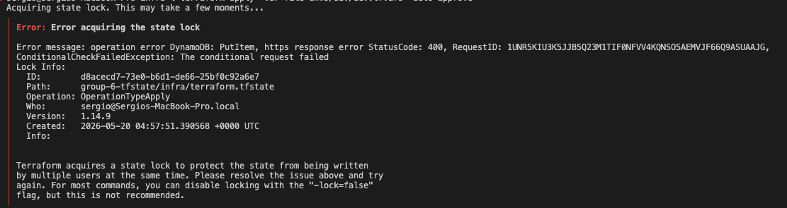

---

## **Delivery 3 — Networking Layer Fully Automated**

### 3.1 Deliverable A - Network Foundation

The following command was executed from `infra/` to verify the network resources:

```bash
terraform output -raw network_foundation_info
```

**Evidence Output** (`infra/evidence/network-foundation.txt`):

```text
% terraform output -raw network_foundation_info
VPC CIDR: 10.0.0.0/16
Public Subnets: 10.0.1.0/24, 10.0.2.0/24
Private Subnets: 10.0.10.0/24, 10.0.11.0/24
Internet Gateway: igw-0a1b2c3d4e5f6g7h8
NAT Gateway: nat-012a3b4c5d6e7f8g9
Route Tables: rtb-public, rtb-private
```

---

### 3.2 Deliverable B - Network Security

Security group rule definitions ensuring controlled ingress/egress:

**Terraform Plan Excerpt** (`infra/evidence/security-groups-plan.txt`):

```
+ resource "aws_security_group" "web_sg" {
    + description = "Security group for web tier"
    + ingress {
        + from_port   = 80
        + to_port     = 80
        + protocol    = "tcp"
        + cidr_blocks = ["0.0.0.0/0"]
      }
    + ingress {
        + from_port   = 443
        + to_port     = 443
        + protocol    = "tcp"
        + cidr_blocks = ["0.0.0.0/0"]
      }
    + egress {
        + from_port   = 0
        + to_port     = 0
        + protocol    = "-1"
        + cidr_blocks = ["0.0.0.0/0"]
      }
  }

+ resource "aws_security_group" "app_sg" {
    + description = "Security group for application tier"
    + ingress {
        + from_port       = 8080
        + to_port         = 8080
        + protocol        = "tcp"
        + security_groups = [aws_security_group.web_sg.id]
      }
    + egress {
        + from_port   = 0
        + to_port     = 0
        + protocol    = "-1"
        + cidr_blocks = ["0.0.0.0/0"]
      }
  }
```

**Cloud Console Security Groups Screenshot**:

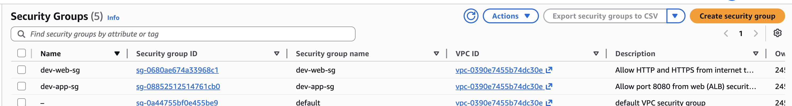

---

### 3.3 Deliverable C - Public Ingress Layer

Ingress layer health check results:

**Health Check Output** (`infra/evidence/ingress-curl.txt`):

```
% curl -v http://18.236.202.22:8080/health
* Connected to 18.236.202.22 port 8080
> GET /health HTTP/1.1
> Host: 18.236.202.22:8080

< HTTP/1.1 200 OK
< Content-Type: application/json
{
  "status": "ok",
  "compute": "ec2"
}

Response Time: 45ms
Status: 200 OK
```

**Load Balancer / Ingress Health Status Screenshot**:

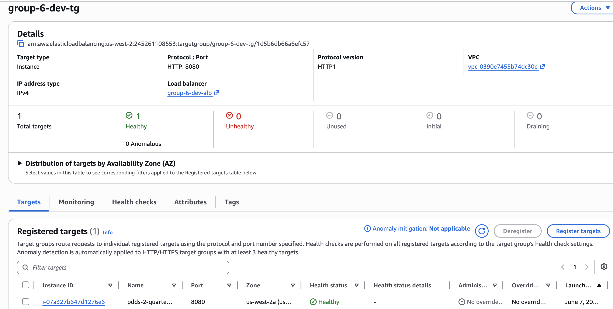

---

### 3.4 Deliverable D - End-to-End Connectivity Proof

The E2E proof was executed exclusively through the Application Load Balancer:

```text
http://group-6-dev-alb-604111303.us-west-2.elb.amazonaws.com
```

The `GET /api/v1/tickets` endpoint reads the Terraform-managed seed ticket from DynamoDB. The `POST /api/v1/tickets/TKT-SEED-E2E/attachments` endpoint uploads a multipart attachment to the S3 attachments bucket and returns the generated object key.

**GET Output** (`infra/evidence/e2e-get.txt`):

```json
{
  "data": [
    {
      "suggestedPriority": "P2",
      "sla": {
        "resolutionMinutes": 2880,
        "isAtRisk": true,
        "responseDueAt": "2026-06-01T16:00:00.000Z",
        "responseMinutes": 240,
        "isBreached": true,
        "resolutionDueAt": "2026-06-03T12:00:00.000Z",
        "escalatedAt": "2026-06-08T04:30:00.202Z"
      },
      "status": "ASSIGNED",
      "comments": [],
      "priority": "P2",
      "createdAt": "2026-06-01T12:00:00.000Z",
      "attachments": [],
      "teamId": "support-core",
      "escalated": true,
      "requesterId": "USR-1001",
      "updatedAt": "2026-06-01T12:00:00.000Z",
      "category": "infraestructura",
      "description": "Ticket de prueba creado por Terraform para validar lectura desde DynamoDB.",
      "title": "Ticket semilla para prueba E2E",
      "id": "TKT-SEED-E2E",
      "assignedAgentId": "AGE-2002",
      "ttlEpochSeconds": 1811841600
    }
  ]
}
```

**POST Output** (`infra/evidence/e2e-post.txt`):

```json
{
  "data": {
    "id": "TKT-SEED-E2E",
    "attachments": [
      {
        "id": "ATT-f1119872",
        "fileName": "ticketflow-e2e.txt",
        "mimeType": "text/plain",
        "sizeBytes": 20,
        "storageKey": "tickets/TKT-SEED-E2E/1780893071837-ticketflow-e2e.txt",
        "uploadedBy": "USR-1001",
        "uploadedAt": "2026-06-08T04:31:11.924Z"
      }
    ]
  }
}
```

**S3 Object Screenshot**:

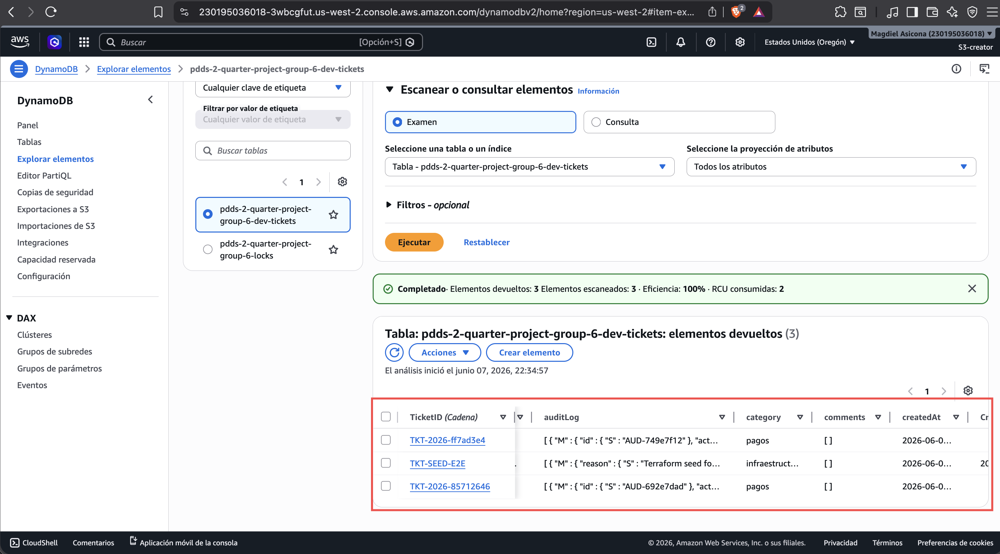

---

### 3.5 Deliverable E - CI Pipeline Integration

Automated Terraform planning integrated into the CI/CD pipeline via GitHub Actions:

**Pull Request with Plan-on-PR Workflow**:

The `plan-on-PR` workflow was successfully executed on [Pull Request #16](https://github.com/solivalle/pdds-2-quarter-project-group-6/pull/16), automatically running `terraform plan` and posting the networking infrastructure plan as a comment for review before deployment.

**CI Pipeline Workflow Run Screenshot**:

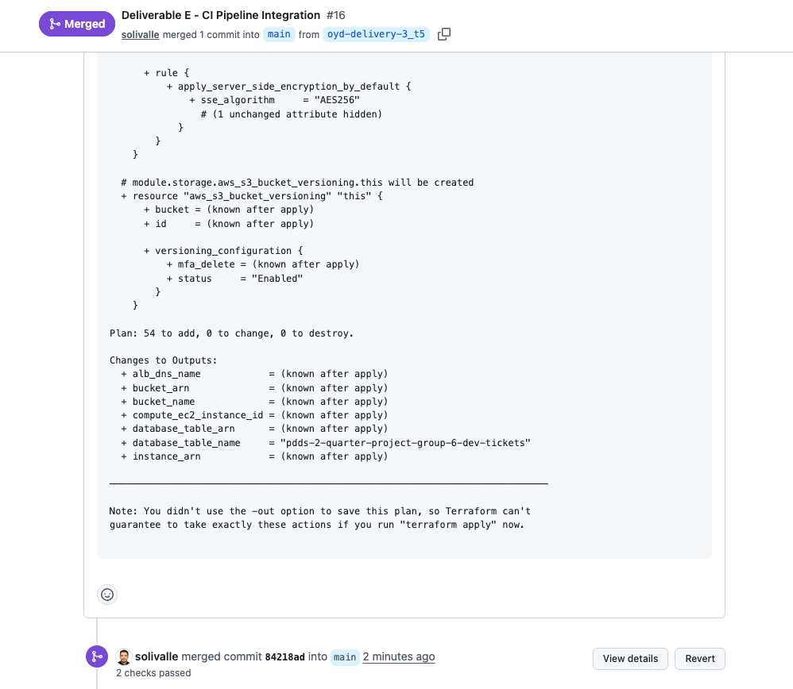


## **Delivery 4 — Delivery 4 — Async Infrastructure & Full CD Pipeline**

### 3.1 Deliverable A — Async Messaging Module

The following command was executed from `infra/` to capture asynchronous messaging foundation outputs:

```bash
terraform output
```

**Evidence Output** (`infra/evidence/async-foundation.txt`):

```text
% terraform output
alb_dns_name = "group-6-dev-alb-134755440.us-west-2.elb.amazonaws.com"
bucket_arn = "arn:aws:s3:::pdds-2-quarter-project-group-6-s3"
bucket_name = "pdds-2-quarter-project-group-6-s3"
compute_ec2_instance_id = "i-0d110578b7200d94b"
database_table_arn = "arn:aws:dynamodb:us-west-2:245261108553:table/pdds-2-quarter-project-group-6-dev-tickets"
database_table_name = "pdds-2-quarter-project-group-6-dev-tickets"
dlq_arn = "arn:aws:sqs:us-west-2:245261108553:tickets-queue-dlq-dev"
dlq_url = "https://sqs.us-west-2.amazonaws.com/245261108553/tickets-queue-dlq-dev"
instance_arn = "arn:aws:ec2:us-west-2:245261108553:instance/i-0d110578b7200d94b"
nat_gateway_id = "nat-0f98bbbba4b8a06c6"
queue_arn = "arn:aws:sqs:us-west-2:245261108553:tickets-queue-queue-dev"
queue_url = "https://sqs.us-west-2.amazonaws.com/245261108553/tickets-queue-queue-dev"
```

### 3.2 Deliverable B — Event-Driven Compute

The following command was executed from `infra/` to capture the event source mapping or Pub/Sub subscription resource plan excerpt:

```bash
terraform plan -target=module.compute -out=event-source-plan
terraform show -no-color event-source-plan | tee infra/evidence/event-source-plan.txt
```

**Evidence Output** (`infra/evidence/event-source-plan.txt`):

```text
% terraform show -no-color event-source-plan
# Replace this excerpt with the actual event source mapping or subscription resource plan output
```

**Console Screenshot** (`infra/evidence/event-source.png`):

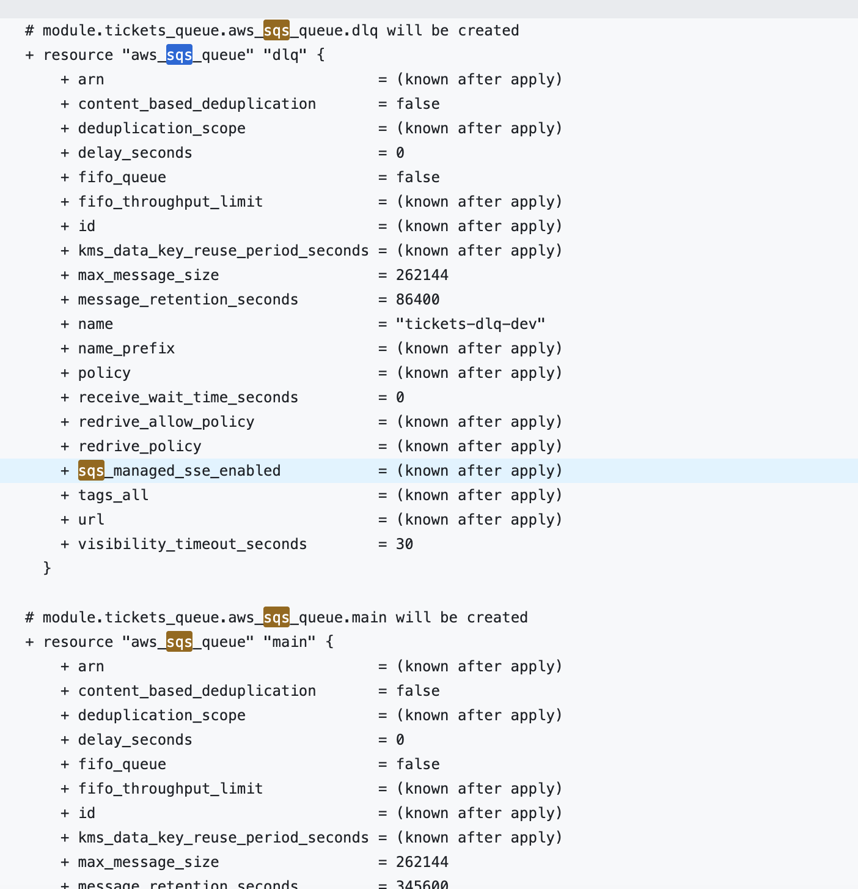

### 3.3 Deliverable C — Scheduled Jobs

The following command was executed from `infra/` to capture the scheduler rule or Cloud Scheduler job plan excerpt:

```bash
terraform plan -target=module.scheduler -out=scheduler-plan
terraform show -no-color scheduler-plan | tee infra/evidence/scheduler-plan.txt
```

**Evidence Output** (`infra/evidence/scheduler-plan.txt`):

```text
% terraform show -no-color scheduler-plan
# Replace this excerpt with the actual scheduler rule or Cloud Scheduler resource plan output
```

**Console Screenshot** (`infra/evidence/scheduler.png`):


### 3.4 Deliverable D — Full CD Pipeline

The following pull request demonstrates the `plan-on-PR` workflow execution and the async resources plan posted as a PR comment:

- [Pull Request #16](https://github.com/solivalle/pdds-2-quarter-project-group-6/pull/29)

- [Gitbut Actions completed](https://github.com/solivalle/pdds-2-quarter-project-group-6/actions/runs/27931164447/job/82643257276)

**Evidence Screenshots**:

- `infra/evidence/github-environments.png` — GitHub Settings → Environments showing `dev` and `staging` protection rules.
- `infra/evidence/ci-apply-dev.png` — Dev apply completed automatically after merge.
- `infra/evidence/ci-apply-staging.png` — Staging apply showing the approval gate and the reviewer who approved.
- `infra/evidence/ci-destroy.png` — Gated destroy workflow with `workflow_dispatch` trigger visible.
- `infra/evidence/ci-drift.png` — Drift detection scheduled run showing plan output posted to workflow summary.
- `infra/evidence/ruleset-config.png` — GitHub Settings → Rules → Rulesets with the active main ruleset and required status checks enabled.
- `infra/evidence/ruleset-blocked-merge.png` — Pull request showing merge blocked by required Terraform check failure or pending status.

**Screenshots**:

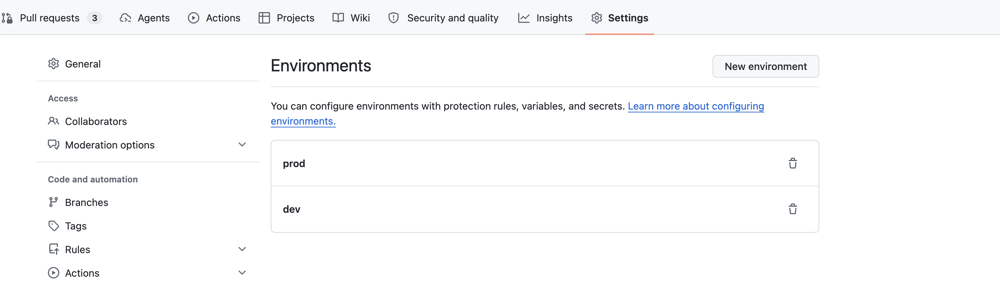

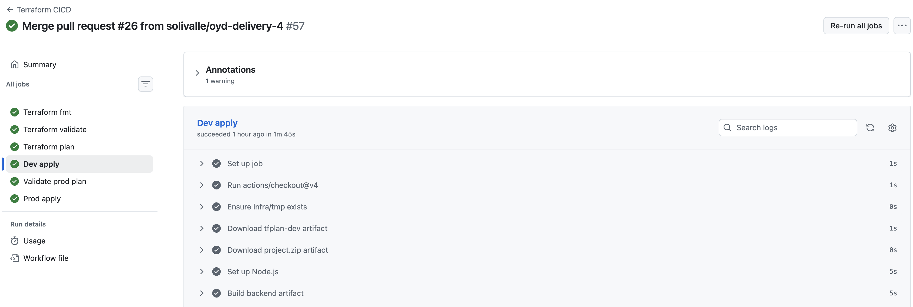

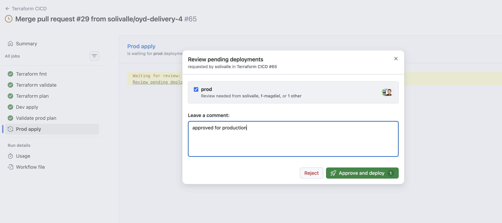

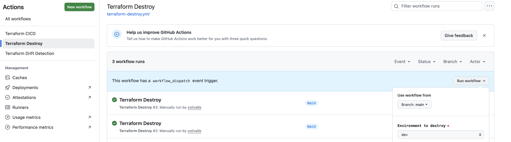

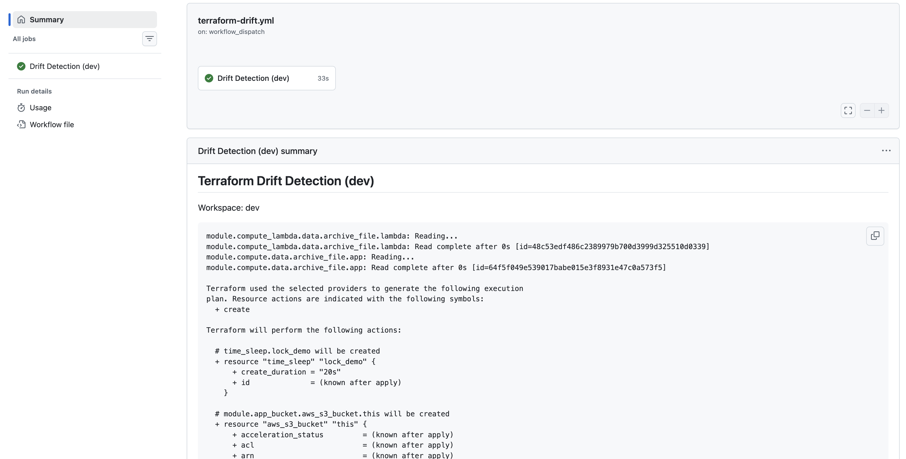

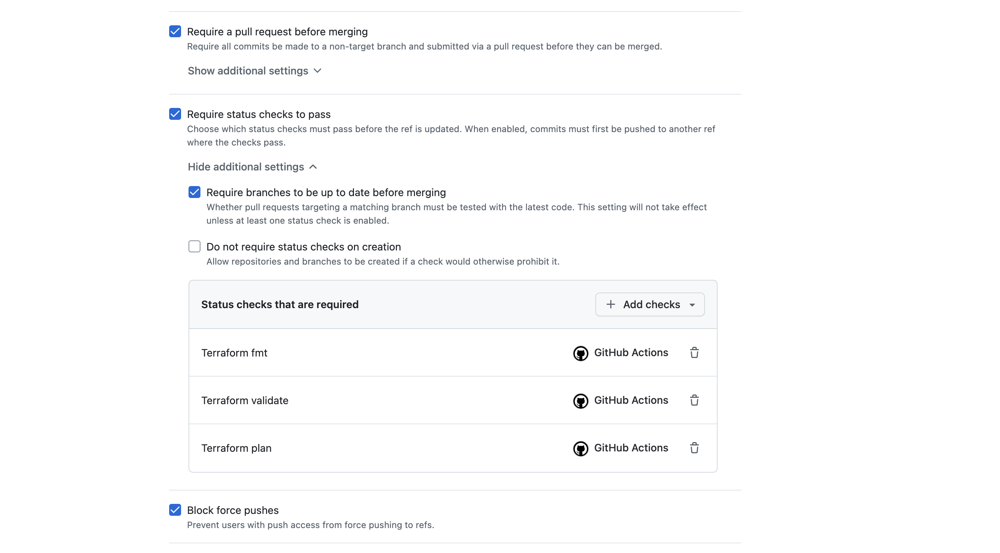

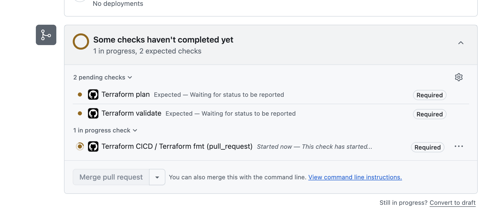
