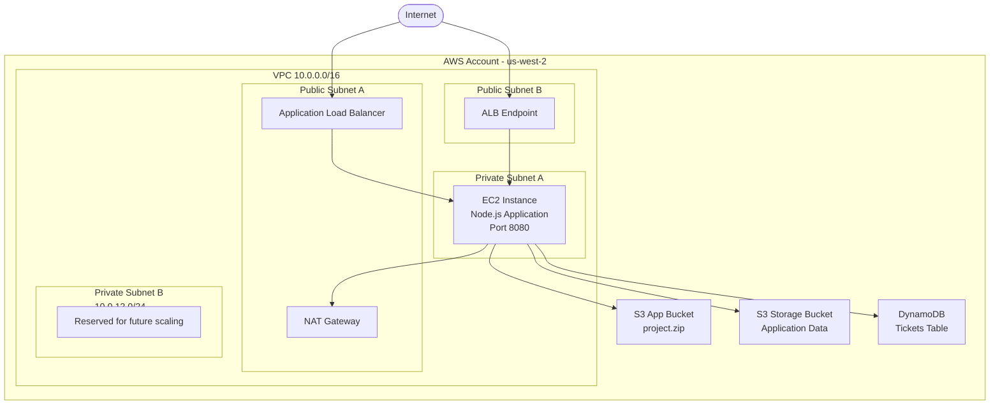
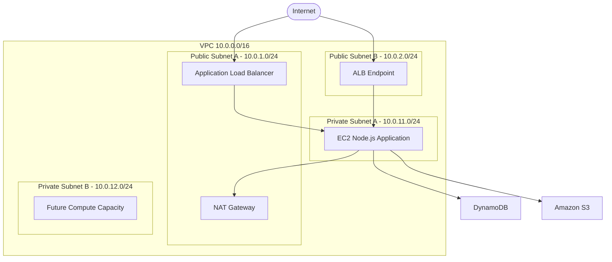

# Resumen de cambios respecto a la Entrega 2 (E2)

## Objetivo de la actualización

A partir de la retroalimentación y el análisis realizado durante el diseño de arquitectura, se incorporó una capa completa de red y acceso seguro a la aplicación. Los principales cambios consistieron en la creación de los módulos **network** e **ingress**, la reubicación de la instancia EC2 dentro de una subred privada y la configuración de acceso controlado hacia los servicios de almacenamiento y persistencia (Amazon S3 y DynamoDB).

---

# Diseño de red implementado

Se diseñó una red aislada utilizando una VPC dedicada con segmentación entre recursos públicos y privados.

## VPC

| Recurso            | Valor                  |
| ------------------ | ---------------------- |
| CIDR VPC           | 10.0.0.0/16            |
| Región             | us-west-2              |
| Availability Zones | us-west-2a, us-west-2b |

---

## Subredes públicas

Las subredes públicas alojan los componentes que requieren exposición a Internet.

| Subred   | Availability Zone | CIDR        |
| -------- | ----------------- | ----------- |
| Public A | us-west-2a        | 10.0.1.0/24 |
| Public B | us-west-2b        | 10.0.2.0/24 |

Estas subredes contienen:

* Application Load Balancer (ALB)
* NAT Gateway
* Conectividad hacia Internet mediante Internet Gateway

---

## Subredes privadas

Las subredes privadas alojan los componentes internos de la aplicación.

| Subred    | Availability Zone | CIDR         |
| --------- | ----------------- | ------------ |
| Private A | us-west-2a        | 10.0.11.0/24 |
| Private B | us-west-2b        | 10.0.12.0/24 |

Estas subredes están protegidas de acceso directo desde Internet y utilizan el NAT Gateway para tráfico saliente cuando es necesario.

---

## Flujo de comunicación

```text
Internet
    │
    ▼
Application Load Balancer
(Public Subnets)
    │
    ▼
EC2 NodeJS
(Private Subnet A)
    │
    ├── DynamoDB
    │
    └── S3
```

---

# Nuevo módulo: Network

Se creó un módulo dedicado a la administración de la infraestructura de red.

## Componentes incorporados

### VPC

* VPC dedicada con CIDR 10.0.0.0/16.
* DNS Hostnames habilitados.
* DNS Resolution habilitada.

### Subredes

* 2 subredes públicas distribuidas en distintas Availability Zones.
* 2 subredes privadas distribuidas en distintas Availability Zones.

### Internet Gateway

Permite que los recursos ubicados en las subredes públicas puedan recibir y enviar tráfico hacia Internet.

### NAT Gateway

Se implementó un NAT Gateway en la subred pública A para proporcionar acceso saliente a Internet desde las subredes privadas sin exponer directamente las instancias.

### Route Tables

Se configuraron tablas de ruteo independientes:

**Route Table Pública**

* 0.0.0.0/0 → Internet Gateway

**Route Table Privada**

* 0.0.0.0/0 → NAT Gateway

### Security Groups

#### Web Security Group

Responsable de permitir acceso público hacia el Application Load Balancer.

Puertos habilitados:

* TCP 80 (HTTP)
* TCP 443 (HTTPS)

Origen:

```text
0.0.0.0/0
```

#### App Security Group

Responsable de proteger la capa de aplicación.

Puertos habilitados:

* TCP 8080

Origen permitido:

* Únicamente tráfico proveniente del Security Group asociado al ALB.

Esto evita que la aplicación sea accesible directamente desde Internet.

---

# Nuevo módulo: Ingress

Se incorporó un módulo específico para gestionar el ingreso de tráfico a la aplicación.

## Application Load Balancer (ALB)

El ALB fue desplegado sobre las dos subredes públicas para proporcionar:

* Punto único de entrada a la aplicación.
* Distribución de tráfico.
* Separación entre la capa pública y la capa de cómputo.
* Mayor flexibilidad para futuras expansiones.

## Target Group

Se configuró un Target Group con las siguientes características:

* Protocolo HTTP.
* Puerto 8080.
* Tipo de destino: Instance.

La instancia EC2 se registra automáticamente como destino del Target Group.

## Listener HTTP

Se configuró un Listener en:

```text
Puerto 80
```

que reenvía todas las solicitudes al Target Group correspondiente.

## Health Checks

Se incorporó monitoreo automático mediante:

```text
GET /health
```

permitiendo verificar el estado de la aplicación antes de enviar tráfico.

---

# Ajustes realizados al módulo de cómputo

## Migración de EC2 a una subred privada

Uno de los cambios más importantes fue mover la instancia EC2 desde un enfoque público a una arquitectura privada.

La instancia ahora se despliega en:

```text
Private Subnet A
10.0.11.0/24
```

Beneficios:

* No posee acceso directo desde Internet.
* Reduce la superficie de ataque.
* Todo acceso externo pasa obligatoriamente por el ALB.

---

## Integración con el ALB

Se agregó la asociación automática de la instancia EC2 con el Target Group mediante:

```text
aws_lb_target_group_attachment
```

Esto permite que el ALB enrute tráfico hacia la aplicación NodeJS que escucha en el puerto 8080.

---

## Acceso seguro a S3

Se incorporó un IAM Role asociado a la instancia EC2 mediante un Instance Profile.

Se configuraron permisos para:

### Bucket de despliegue

Permisos:

* s3:GetObject

Utilizado para descargar el artefacto de la aplicación (`project.zip`) durante el arranque de la instancia.

### Bucket de almacenamiento

Permisos:

* s3:ListBucket
* s3:GetObject
* s3:PutObject
* s3:DeleteObject

Permitiendo operaciones CRUD desde la aplicación.

---

## Acceso seguro a DynamoDB

Se agregaron permisos IAM específicos para la tabla DynamoDB.

Operaciones permitidas:

* GetItem
* PutItem
* UpdateItem
* DeleteItem
* Query
* Scan

De esta manera la aplicación puede interactuar directamente con la base de datos sin almacenar credenciales estáticas.

---

# Impacto sobre la arquitectura

La arquitectura evolucionó desde una solución centrada únicamente en cómputo y almacenamiento hacia una arquitectura multicapa con segmentación de red, control de acceso y separación entre componentes públicos y privados.

Las principales mejoras obtenidas fueron:

* Incorporación de una VPC dedicada.
* Segmentación mediante subredes públicas y privadas.
* Protección de la aplicación detrás de un Application Load Balancer.
* Eliminación de acceso directo a la instancia EC2.
* Acceso controlado a DynamoDB mediante IAM Roles.
* Acceso controlado a S3 mediante IAM Roles.
* Conectividad saliente segura mediante NAT Gateway.
* Preparación para futuras expansiones multi-AZ y escalamiento horizontal.

# Diagrama de Contenedores (Primera Versión)

El siguiente diagrama muestra los principales componentes del sistema y su ubicación dentro de la arquitectura de red definida para el proyecto.

- El tráfico ingresa desde Internet hacia un Application Load Balancer (ALB).
- El ALB está desplegado en las subnets públicas.
- La instancia EC2 que ejecuta la aplicación Node.js reside en una subnet privada.
- DynamoDB y S3 son servicios administrados de AWS, por lo que no residen dentro de una subnet específica de la VPC, pero son consumidos por la aplicación.
- La instancia EC2 utiliza IAM Roles para acceder a DynamoDB y S3 sin almacenar credenciales.
- El NAT Gateway permite que la instancia privada descargue dependencias y acceda a servicios externos cuando sea necesario.

## Diagrama Mermaid



## Componentes principales

### Compute
- Instancia EC2 Amazon Linux 2023 (`t4g.nano`).
- Aplicación Node.js ejecutándose en el puerto `8080`.
- Desplegada en la subnet privada `10.0.11.0/24`.
- Registrada automáticamente en el Target Group del ALB.

### Base de datos
- Tabla DynamoDB para almacenamiento de tickets.
- Acceso mediante IAM Role asociado a la instancia EC2.
- No expone endpoints públicos dentro de la arquitectura.

### Storage
- Bucket S3 para despliegue de la aplicación (`project.zip`).
- Bucket S3 para almacenamiento de datos de negocio.
- Acceso controlado mediante políticas IAM asignadas a la instancia EC2.

### Ingress
- Application Load Balancer desplegado en las subnets públicas:
  - `10.0.1.0/24`
  - `10.0.2.0/24`
- Escucha tráfico HTTP en puerto 80.
- Reenvía solicitudes hacia la aplicación en puerto 8080.

### Networking
- VPC: `10.0.0.0/16`
- Dos Availability Zones:
  - `us-west-2a`
  - `us-west-2b`
- Subnets públicas para componentes expuestos a Internet.
- Subnets privadas para la capa de aplicación.
- NAT Gateway para salida controlada a Internet desde recursos privados.

# Diseño de Red

## Objetivo

El diseño de red propuesto busca implementar una arquitectura segura y escalable para la aplicación, separando los componentes expuestos a Internet de los recursos internos mediante el uso de subnets públicas y privadas dentro de una VPC dedicada.

---

# Arquitectura de Red

## VPC

Se creó una VPC dedicada con el siguiente rango CIDR:

| Recurso | CIDR        |
| ------- | ----------- |
| VPC     | 10.0.0.0/16 |

Este rango proporciona suficiente espacio para segmentar la infraestructura en múltiples subredes y facilitar futuras expansiones.

---

## Subnets

La arquitectura utiliza dos Availability Zones (AZs) para aumentar la disponibilidad y resiliencia ante fallos de infraestructura.

### Subnets Públicas

Las subnets públicas alojan los recursos que deben ser accesibles desde Internet.

| Subnet   | CIDR        | Availability Zone | Uso              |
| -------- | ----------- | ----------------- | ---------------- |
| Public A | 10.0.1.0/24 | us-west-2a        | ALB, NAT Gateway |
| Public B | 10.0.2.0/24 | us-west-2b        | ALB              |

### Subnets Privadas

Las subnets privadas alojan los componentes internos del sistema.

| Subnet    | CIDR         | Availability Zone | Uso                               |
| --------- | ------------ | ----------------- | --------------------------------- |
| Private A | 10.0.11.0/24 | us-west-2a        | EC2 Application                   |
| Private B | 10.0.12.0/24 | us-west-2b        | Capacidad para crecimiento futuro |

---

# Diagrama de Red



---

# Número de Availability Zones y Justificación

Se utilizaron dos Availability Zones:

* us-west-2a
* us-west-2b

### Razones

1. Alta disponibilidad

   El Application Load Balancer requiere al menos dos subnets en diferentes Availability Zones para distribuir tráfico y mantener disponibilidad ante la caída de una zona.

2. Tolerancia a fallos

   Si una Availability Zone presenta problemas, la infraestructura de red continúa operando desde la segunda zona.

3. Escalabilidad futura

   Actualmente la aplicación utiliza una sola instancia EC2 en la subnet privada A, pero la arquitectura permite desplegar instancias adicionales en la subnet privada B sin rediseñar la red.

---

# Flujo de Tráfico

El tráfico sigue la siguiente ruta:

```text
Internet
    ↓
Application Load Balancer (Puerto 80)
    ↓
EC2 privada (Puerto 8080)
    ↓
DynamoDB / S3
```

La instancia EC2 no posee dirección IP pública y únicamente acepta tráfico proveniente del Load Balancer.

---

# Conectividad Saliente

## Opción Implementada: NAT Gateway

La instancia EC2 se encuentra en una subnet privada y utiliza un NAT Gateway para acceder a Internet cuando es necesario.

Ejemplos:

* Descargar paquetes del sistema operativo.
* Acceder a repositorios externos.
* Obtener dependencias de software.
* Consumir APIs externas.

Flujo:

```text
EC2 privada
    ↓
NAT Gateway
    ↓
Internet Gateway
    ↓
Internet
```

---

# Alternativa Evaluada: VPC Endpoints

AWS ofrece VPC Endpoints para acceder a servicios administrados sin utilizar Internet.

Ejemplos:

* Amazon S3
* DynamoDB

Flujo:

```text
EC2 privada
    ↓
VPC Endpoint
    ↓
Servicio AWS
```

---

# Trade-Off: NAT Gateway vs VPC Endpoints

| Aspecto                | NAT Gateway | VPC Endpoint             |
| ---------------------- | ----------- | ------------------------ |
| Acceso a Internet      | Sí          | No                       |
| Acceso a S3            | Sí          | Sí                       |
| Acceso a DynamoDB      | Sí          | Sí                       |
| Acceso a APIs externas | Sí          | No                       |
| Seguridad              | Menor       | Mayor                    |
| Complejidad            | Menor       | Mayor                    |
| Costo para tráfico AWS | Mayor       | Menor                    |
| Flexibilidad           | Alta        | Limitada a servicios AWS |

---

# Decisión Adoptada

Para esta versión del proyecto se implementó un NAT Gateway debido a que:

* Simplifica la arquitectura.
* Permite salida a Internet para la instancia EC2.
* Facilita la instalación de dependencias y actualizaciones.
* Reduce la complejidad operativa durante el desarrollo.

Sin embargo, para un entorno productivo sería recomendable complementar o reemplazar parcialmente el NAT Gateway mediante VPC Endpoints para Amazon S3 y DynamoDB, reduciendo costos y evitando que el tráfico hacia servicios AWS salga a Internet.

# Anexo IA: Exploración de Diseño de Red y Patrones Descartados

## Uso de IA durante el diseño de red

Durante la elaboración de la arquitectura de infraestructura se utilizó IA como herramienta de apoyo para analizar alternativas de diseño en AWS, comprender las implicaciones de seguridad de cada componente y validar la conectividad entre los distintos servicios del proyecto.

Las sesiones de exploración se enfocaron principalmente en los siguientes temas:

* Diseño de VPC y segmentación de red.
* Uso de subnets públicas y privadas.
* Necesidad de utilizar un Application Load Balancer (ALB).
* Necesidad de utilizar un NAT Gateway.
* Comunicación entre EC2, S3 y DynamoDB.
* Seguridad mediante Security Groups e IAM Roles.
* Evaluación de alternativas de conectividad mediante VPC Endpoints.

---

# Exploraciones realizadas

## 1. Diseño de la VPC

Se exploraron diferentes alternativas para estructurar la red del proyecto.

Inicialmente se analizaron dos módulos de infraestructura que contenían recursos parcialmente superpuestos. Mediante el análisis asistido por IA se identificó que el módulo de red era el que mejor respondía a los requerimientos del enunciado, ya que incluía:

* VPC con CIDR explícito.
* Subnets públicas.
* Subnets privadas.
* Internet Gateway.
* NAT Gateway.
* Route Tables.
* Asociaciones de rutas.
* Security Groups.

Esto permitió construir una arquitectura alineada con los requisitos de la entrega.

---

## 2. Ubicación de la instancia EC2

Se evaluó inicialmente la posibilidad de desplegar la instancia EC2 en una subnet pública.

Sin embargo, la IA sugirió una arquitectura más segura donde:

* El Application Load Balancer se expone a Internet.
* La instancia EC2 permanece en una subnet privada.
* Todo el tráfico externo ingresa exclusivamente a través del ALB.

Arquitectura seleccionada:

```text
Internet
   ↓
ALB (Subnet pública)
   ↓
EC2 (Subnet privada)
```

### Beneficios

* La instancia EC2 no posee dirección IP pública.
* No existe acceso directo desde Internet hacia el servidor.
* Se reduce significativamente la superficie de ataque.

---

## 3. Necesidad del Application Load Balancer

Durante la exploración se analizó si el proyecto requería realmente un ALB considerando que solo existe una instancia EC2.

La conclusión fue mantener el ALB debido a que:

* Es un requisito habitual en arquitecturas de producción.
* Permite desacoplar el punto de entrada público de la aplicación.
* Facilita futuras ampliaciones horizontales.
* Centraliza las reglas de acceso.

Además, el ALB escucha tráfico HTTP en el puerto 80 y lo redirige al puerto 8080 donde se ejecuta la aplicación Node.js.

```text
Internet
   ↓
ALB :80
   ↓
EC2 :8080
```

---

## 4. NAT Gateway para conectividad saliente

Uno de los temas más explorados fue la necesidad de permitir que la instancia EC2, ubicada en una subnet privada, pudiera acceder a Internet.

La aplicación requiere:

* Descargar el paquete desplegado en S3.
* Instalar dependencias del sistema operativo.
* Ejecutar comandos de inicialización durante el bootstrap.
* Posibilidad futura de consumir APIs externas.

La IA explicó que una instancia privada no puede acceder directamente a Internet, por lo que se evaluaron dos alternativas:

### Alternativa A: NAT Gateway

```text
EC2 Privada
      ↓
NAT Gateway
      ↓
Internet
```

### Alternativa B: VPC Endpoints

```text
EC2 Privada
      ↓
VPC Endpoint
      ↓
Servicio AWS
```

Finalmente se seleccionó NAT Gateway por simplicidad y flexibilidad para el alcance actual del proyecto.

---

## 5. Comunicación entre EC2 y S3

Inicialmente se evaluó la posibilidad de utilizar credenciales AWS almacenadas dentro de la instancia.

La IA sugirió descartar esta aproximación por motivos de seguridad.

En su lugar se implementó:

* IAM Role asociado a la instancia EC2.
* IAM Instance Profile.
* Políticas específicas para acceso a S3.

La aplicación obtiene permisos automáticamente sin almacenar claves de acceso.

### Patrón descartado

```text
EC2
  └── Access Key
  └── Secret Key
```

### Patrón adoptado

```text
EC2
  └── IAM Role
         └── Permisos S3
```

---

## 6. Comunicación entre EC2 y DynamoDB

También se exploró la mejor forma de acceder a DynamoDB.

La IA sugirió reutilizar el mismo enfoque utilizado para S3:

* IAM Role.
* Políticas de mínimo privilegio.
* Acceso únicamente a la tabla requerida.

La instancia EC2 recibió permisos explícitos para:

* GetItem
* PutItem
* UpdateItem
* DeleteItem
* Query
* Scan

---

# Patrones sugeridos por IA que fueron descartados

## Despliegue de EC2 en subnet pública

### Motivo del descarte

Aunque simplifica la conectividad, expone directamente la instancia a Internet y reduce el nivel de seguridad.

---

## Acceso directo desde Internet a la aplicación en el puerto 8080

### Motivo del descarte

La arquitectura final exige que todo el tráfico pase primero por el Application Load Balancer.

---

## Uso de credenciales AWS almacenadas en la instancia

### Motivo del descarte

Representa una mala práctica de seguridad y dificulta la rotación de credenciales.

Se reemplazó por IAM Roles.

---

## Uso exclusivo de VPC Endpoints

### Motivo del descarte

Aunque reduce costos y mejora la seguridad para servicios AWS, no permite acceso a Internet para instalación de dependencias ni para futuras integraciones externas.

Para esta fase del proyecto se priorizó la simplicidad mediante NAT Gateway.

---

# Conclusiones

La utilización de IA permitió evaluar diferentes alternativas arquitectónicas y comprender los trade-offs asociados a cada una. Como resultado, se adoptó una arquitectura basada en una VPC segmentada con subnets públicas y privadas, Application Load Balancer como punto de entrada, instancia EC2 protegida en una subnet privada, acceso controlado mediante IAM Roles y conectividad saliente a través de NAT Gateway.

Las recomendaciones de IA contribuyeron principalmente a fortalecer la seguridad del diseño, simplificar la gestión de permisos y mantener una arquitectura alineada con prácticas comunes de despliegue en AWS.
