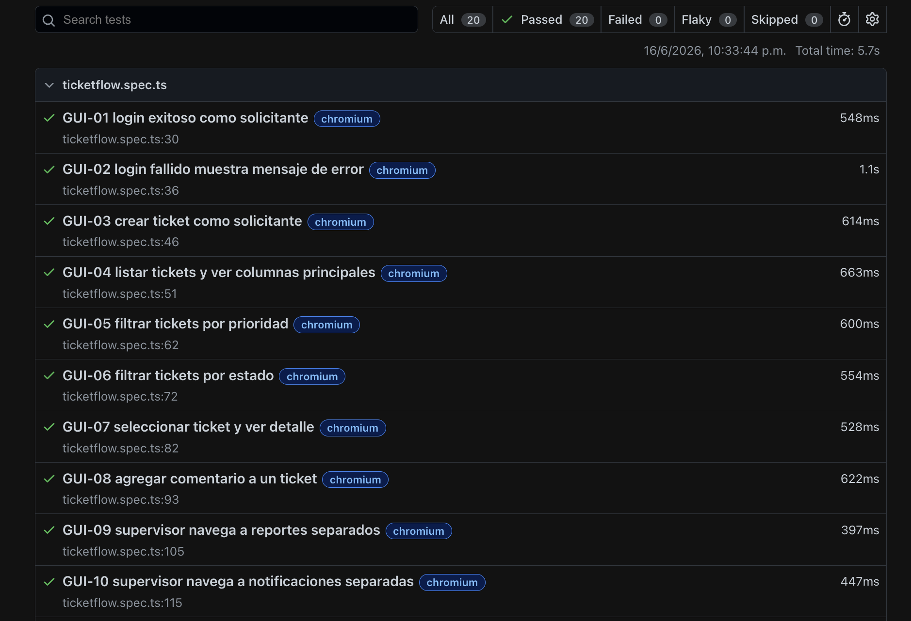
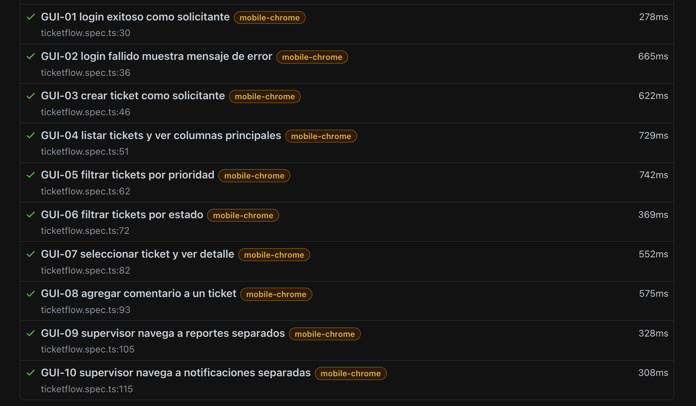

# Pruebas automaticas de interfaz grafica - TicketFlow

## Herramienta seleccionada

Se utilizo Playwright porque permite automatizar pruebas end-to-end sobre navegadores reales, validar elementos visibles de la interfaz y generar reporte HTML con evidencia de ejecucion.

- Framework: `@playwright/test`
- Navegador configurado: Chromium
- Ubicacion de pruebas en el proyecto: `frontend/e2e/ticketflow.spec.ts`
- Copia para entrega: `testing/automation/ticketflow.spec.ts`
- Configuracion en el proyecto: `frontend/playwright.config.ts`
- Copia para entrega: `testing/automation/playwright.config.ts`
- Reporte HTML generado: `testing/evidence/playwright-report/index.html`

## Instalacion

Desde la raiz del proyecto:

```bash
npm install --prefix frontend
npm --prefix frontend exec playwright install chromium
```

## Ejecucion

Para ejecutar las pruebas:

```bash
npm --prefix frontend run test:e2e
```

El runner compila el frontend, compila el backend, levanta el servidor Express con el frontend estatico y ejecuta los escenarios contra `http://127.0.0.1:18080`.

Para visualizar el reporte HTML:

```bash
npm --prefix frontend run test:e2e:report
```

Tambien se puede abrir directamente el archivo generado:

```text
testing/evidence/playwright-report/index.html
```

## Precondiciones

- Node.js instalado.
- Dependencias del frontend instaladas.
- Chromium instalado por Playwright.
- Backend funcional con usuarios demo.
- Usuarios demo disponibles:
  - Solicitante: `ana@ticketflow.local`
  - Agente: `luis@ticketflow.local`
  - Supervisor: `sofia@ticketflow.local`
- Password de usuarios demo: `demo123`

## Archivo de automatizacion

Los 10 escenarios estan automatizados en:

```text
frontend/e2e/ticketflow.spec.ts
testing/automation/ticketflow.spec.ts
```

La configuracion de ejecucion, navegadores y servidor de pruebas esta en:

```text
frontend/playwright.config.ts
testing/automation/playwright.config.ts
```

## Escenarios automatizados

| ID | Escenario | Precondicion | Pasos principales | Resultado esperado | Estado |
| --- | --- | --- | --- | --- | --- |
| GUI-01 | Login exitoso como solicitante | Usuario solicitante existente | Abrir app, seleccionar Ana Solicitante, presionar Ingresar | Se muestra Panel operativo con rol REQUESTER y sin acceso a Reportes | Paso |
| GUI-02 | Login fallido | App en pantalla de login | Ingresar correo valido con password incorrecto, presionar Ingresar | Se muestra mensaje de credenciales invalidas y permanece en login | Paso |
| GUI-03 | Crear ticket como solicitante | Solicitante autenticado | Completar titulo, categoria, descripcion y crear ticket | Se muestra confirmacion Ticket creado y el ticket aparece en la tabla | Paso |
| GUI-04 | Listar tickets y columnas principales | Existe al menos un ticket creado | Crear ticket y revisar tabla | La tabla muestra columnas Ticket, Prioridad, Estado y SLA | Paso |
| GUI-05 | Filtrar tickets por prioridad | Existe ticket con prioridad P1 | Crear ticket P1, seleccionar filtro P1 | La tabla contiene el ticket creado y muestra prioridad P1 | Paso |
| GUI-06 | Filtrar tickets por estado | Existe ticket asignado | Crear ticket, seleccionar filtro ASSIGNED | La tabla contiene el ticket creado y muestra estado ASSIGNED | Paso |
| GUI-07 | Ver detalle de ticket | Existe ticket creado | Seleccionar ticket en tabla | Se muestra detalle con titulo, vencimiento de respuesta y vencimiento de resolucion | Paso |
| GUI-08 | Agregar comentario | Existe ticket creado | Seleccionar ticket, escribir comentario y enviar | Se muestra confirmacion Comentario agregado y el comentario aparece visible | Paso |
| GUI-09 | Ver Reportes separados | Supervisor autenticado | Abrir menu Reportes | Se muestra vista Reportes con Rendimiento del servicio y no se muestra vista Notificaciones | Paso |
| GUI-10 | Ver Notificaciones separadas | Supervisor autenticado | Abrir menu Notificaciones | Se muestra vista Notificaciones y no se muestra vista Reportes | Paso |

## Evidencia esperada

Al finalizar la ejecucion, Playwright muestra el resumen en consola con la cantidad de pruebas aprobadas. Tambien genera un reporte HTML en:

```text
testing/evidence/playwright-report/
```

Si una prueba falla, Playwright guarda capturas y contexto en:

```text
frontend/test-results/
```

## Resultado obtenido

La ultima ejecucion registrada fue exitosa:

```text
20 passed
```




La cantidad es 20 porque los 10 escenarios se ejecutan en dos proyectos configurados: Chromium desktop y Chromium mobile.

Resumen:

- Total de escenarios funcionales: 10
- Total de ejecuciones automaticas: 20
- Aprobadas: 20
- Fallidas: 0
- Navegadores/proyectos: `chromium` y `mobile-chrome`
